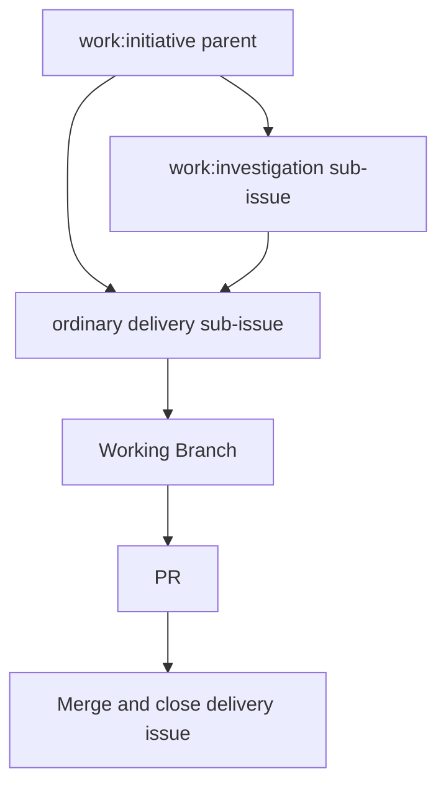

# Issue Triage Router 设计

日期：2026-07-23

状态：决策已批准，待实现

## Goal

为 2–3 人团队建立一个以 GitHub Issues 为协作入口、对 agent 友好的轻量 `issue-triage` skill。它根据用户自然语言、现有 Issue、父子关系、依赖与仓库上下文，先给出简短 triage 建议；只有用户明确确认后，才创建或更新 GitHub Issue、label 和原生关系。

该 skill 的目标是让 agent 可靠回答“这是什么工作、是否应由 agent 或人推进、应建父 Issue 还是 sub-issue、是否被依赖阻塞”，而不把小团队变成需要人工维护复杂流程的工单系统。

## Confirmed Decisions

- GitHub Issue 是实施协作的状态与协调入口；Implementation Package 仍拥有长篇 Design、Spec、Plan、Findings、Gate 和 durable evidence，PR 仍只承担最终 review、CI 与 merge。
- 大事项使用 GitHub 原生父子关系表达。父 Issue 负责目标、范围、稳定文档链接、知情人与关闭条件；可独立验收的工作使用 sub-issue；每个实际交付子 Issue 独立关联 Working Branch 和最终 PR。
- “同事需要知情但暂不行动”使用一次 `@mention` 加 GitHub Subscribe，不使用 assignee。assignee 只表示对下一步行动负责。
- triage 先提案、后发布。读取和提出分类建议无需确认；任何创建、编辑、加 label、添加父子/依赖关系、评论或关闭 Issue 都必须等用户明确确认。
- 不引入 `work:delivery`。普通的叶子 Issue 默认就是交付工作；`work:` 只标注两个需要特殊路由的形态：initiative 和 investigation。
- 现有 `$triage` 是唯一入口，直接替换为本设计的 GitHub Issue router；不创建并行的 `$issue-triage`。保留 `skills/triage/` 路径和 `name: triage`，使团队不需要记忆第二个命令。
- 不把 GitHub Project 的执行 `Status` 与 Issue 的 readiness label 混为一个状态机。Project `Status` 可展示 Todo/In progress/In review/Done；readiness label 决定当前谁可以推进以及是否具备条件。

## Label Contract

### Work shape

| Label | 含义 | 适用规则 |
| --- | --- | --- |
| `work:initiative` | 跨多个独立切片的目标、协调父事项或需要 FYI 的大事项。 | 不能被 agent 当作直接编码任务领取；默认不需要流程 label。 |
| `work:investigation` | 调研、澄清或决策工作。 | 交付是 findings、决策或规范，而非默认代码变更。 |

普通叶子 Issue 没有 `work:` label，即默认交付工作。一个 Issue 最多一个 `work:` label。

### Workflow readiness

| Label | 含义 | 与相邻状态的边界 |
| --- | --- | --- |
| `needs-info` | 工作本身尚未定义充分，例如事实、复现、验收目标或范围缺失。 | 不假定谁会补充；信息不足时使用。 |
| `ready-for-agent` | 输入、边界和验收已足够，agent 或开发者可以开始。 | 开始后可保留该 label；Project `Status` 表示实际执行进度。 |
| `ready-for-human` | 信息已足够，但需要 owner 的决策、授权或评审。 | 不是“必须由人手写代码”。 |
| `blocked` | 工作和验收已明确，但存在明确的外部或 Issue 依赖。 | 必须在正文或 GitHub `blocked by` 关系中指出依赖。 |
| `wontfix` | 已决定不做。 | 添加后立即关闭；不作为开放工作状态。 |

每个开放的 investigation 或普通叶子 Issue 必须有且仅有一个 readiness label。`work:initiative` 默认没有 readiness label；只有父事项本身需要 owner 决策或被外部依赖阻塞时，才添加相应 readiness label。

`needs-info` 表示任务定义缺失；`ready-for-human` 表示定义充分但等待决定；`blocked` 表示定义充分但等待已知依赖。这三者不得同时存在。

### Type and urgency

| Label | 含义 |
| --- | --- |
| `bug` | 现有行为错误，或存在安全、正确性问题。 |
| `enhancement` | 新能力或用户可见改进。 |
| `doc` | 主要验收物是文档事实本身。 |
| `maintenance` | 重构、测试基线、内部清理、依赖维护等。 |
| `blocker` | 不完成会阻碍父事项、合入或关键目标关闭。 |

可执行的叶子 Issue 与 investigation 各有一个 type label；`blocker` 是可选例外标签。`blocker` 不等于 `blocked`：前者说明它阻碍别人，后者说明它自己现在无法推进，二者可以同时出现。

### Retirement and migration mapping

| 旧 label | 新处理方式 |
| --- | --- |
| `question` | 用 `work:investigation` 表达工作性质，再根据输入选择 readiness。 |
| `no-blocker` | 删除；没有 `blocker` 即默认非阻塞。 |
| `duplicate` / `invalid` | 不进入日常 label 体系；关闭时写明原因和关联 Issue。 |

现有 `bug`、`enhancement`、`doc`、`needs-info`、`ready-for-agent`、`ready-for-human`、`blocked`、`wontfix` 保持原名称，避免不必要的批量重命名和文档漂移。

## Parent, Sub-issue, Dependency and PR Rules



- 当目标需要两个或以上可独立关闭的切片、需要协调知情人，或需要汇总关闭条件时，创建 `work:initiative` 父 Issue。
- 当工作有自己的验收标准、依赖、Working Branch 或最终 PR 时，创建 sub-issue；不把每个 PR 直接挂到最初的父事项。
- 当一个请求是单一、可独立验收的切片且没有更高层目标时，创建普通叶子 Issue，不人为创建父事项。
- 当主要未知项是事实或决策时，创建 `work:investigation`；其结论可以关闭该 Issue，也可以产生后续 delivery sub-issue。
- 真实前置条件使用 GitHub 原生 `blocked by` / `blocking` 关系。`blocked` label 只说明当前状态，不能代替关系。
- PR 不是需求入口、不是 triage 对象，也不替代 Issue。PR 必须引用已有 delivery Issue，负责最终审核、CI 和合并。

## Router Contract

### Inputs

router 接受自然语言请求，也可以接受 Issue 号、URL、Implementation Package 路径、PR 链接或当前分支上下文。它读取足以判断的本地和 GitHub 上下文：Issue 正文、评论、labels、assignee、父子关系、依赖、稳定文档链接和当前 Working Branch。

router 只在判断确实依赖代码事实时进行针对性的只读检索；它不对每次新想法强制做完整代码复现、全仓 redundancy audit、grilling 或领域文档修改。

### Read-only triage proposal

在任何外部写入之前，router 返回不超过五行的提案：

```text
Triage proposal
- 操作：创建 sub-issue，父项 #140
- 形态：work:investigation；类型：enhancement；状态：ready-for-agent
- 依赖：无
- 依据：当前先需冻结 adapter 边界；结论将决定后续 delivery 切片
- 发布：等待确认
```

提案可以建议更新既有 Issue、创建父 Issue、创建 sub-issue、设置依赖、仅通知同事，或不创建 Issue。提案必须说明最关键的一条依据。用户确认“发布”“创建”或等效指令后，writer 才执行对应 GitHub 操作。

### Publication behavior

- 创建/更新时，writer 只写已确认的标题、正文最小模板、labels、assignee、父子关系和依赖关系。
- 不自动发表 AI triage 评论、不自动 @mention、不自动创建 Agent Brief、不自动关闭 Issue。
- Issue 进入实际实施协作并开始分支工作时，由开始执行的工作流写入唯一有效的 Working Branch 指针；router 不因创建任务而虚构分支。
- 如果现有 Issue label 不完整或冲突，router 仍可读取和解释它；提案中标出最小修正，而不拒绝服务。

## Minimal Issue Body

父 Issue 只保留 `Outcome`、`Scope / Non-goals`、`Context links`、`Stakeholders` 和 `Closure condition`。`Stakeholders` 只在需要留存知情范围时出现；日常 FYI 优先使用 GitHub Subscribe。

普通叶子或 investigation Issue 只保留 `Outcome`、`Scope / Non-goals`、`Acceptance`、`Context links` 和 `Working Branch`。长篇设计不复制进 Issue，而是链接到 Implementation Package。

## Project Views

一个 GitHub Project 即可，建议保存以下 view：

| View | Filter | 用途 |
| --- | --- | --- |
| Agent queue | `label:"ready-for-agent" -label:"work:initiative"` | 可由 agent 领取的工作。 |
| Human inbox | `label:"ready-for-human","needs-info"` | 需要 owner 决策或补信息的事项。 |
| Blocked | `label:"blocked"` | 跟踪已知依赖。 |
| Initiatives | `label:"work:initiative"` | 查看大事项及子事项进度。 |

Project `Status` 只用于 board 执行可视化，不作为 router 判断 readiness 的唯一事实。

## Assessment of the Existing `triage` Skill

### Reusable concepts

- 先读取 Issue 正文、评论、labels 和关联上下文，再给维护者分类建议。
- 明确区分工作类型与推进状态。
- 在状态变更前向用户说明将发生什么。
- 对已有 triage 记录做增量阅读，避免重复问已解决的问题。

### Incompatible behavior

| 现有 `triage` 行为 | 为什么不适用 | 新体系处理 |
| --- | --- | --- |
| `needs-triage` 是默认入口。 | 新体系不把未判断状态写入 GitHub；router 先在会话中提案。 | 不使用 `needs-triage`。 |
| 外部 PR 与 Issue 共用入站队列。 | KaiSpan 的 PR 不是需求入口，也不用于早期设计协作。 | PR 仅作为既有 delivery Issue 的最终证据。 |
| 只有 `bug` / `enhancement` 两类。 | 缺少 initiative、investigation、doc 和 maintenance。 | 使用本设计的四个 label 维度。 |
| 每个 Issue 强制一类和一状态。 | 父 initiative 不是可执行工作，强贴 readiness 会污染 agent 队列。 | initiative 的 readiness 默认可省略。 |
| 自动发布 AI disclaimer、triage note 与 Agent Brief。 | 会在用户确认前产生外部副作用，并把 Issue 评论错误升级为长期合同。 | 默认只输出会话提案；确认后只执行请求的写入。 |
| 对每次 triage 强制代码 redundancy、复现、grilling 与领域文档更新。 | 对 2–3 人团队过重，且把 issue 路由扩张为设计/诊断流程。 | 只按不确定性做针对性只读检查；深度设计交给独立 skill。 |
| enhancement 的 `wontfix` 写入 `.out-of-scope/`。 | 这是 Matt 流程的知识库政策，当前 GitHub/Implementation Package 体系未采用。 | 关闭理由与稳定决策链接写在 Issue；不新建 `.out-of-scope/` 机制。 |
| `ready-for-human` 表示人工实现。 | 本体系中它表示需要人类决策、授权或评审。 | 保留 label 名称，调整语义。 |

### Design decision

直接原地替换 `skills/triage/`。现有 skill 当前未被团队主动采用，保留它再新增 `$issue-triage` 只会让用户和 agent 面对两个相互竞争的入口；新体系必须成为 `$triage` 的实际语义。

实现时保留 `name: triage` 与 `skills/triage/` 路径，但把说明、状态模型和副作用边界替换为本设计的 router。它只继承现有 skill 的“收集上下文 → 给出建议 → 获得确认 → 执行”交互骨架，不继承 `needs-triage`、PR 入站、自动评论、Agent Brief 或 `.out-of-scope` 职责。

这是一次有意的内部破坏性语义变更，因此实现必须同步更新 `setup-matt-pocock-skills`、其 label seed/reference，以及任何仍声明 Matt 默认 triage 词汇的相邻 skill。`AGENT-BRIEF.md` 和 `OUT-OF-SCOPE.md` 不再是 `triage` 的运行时依赖；实施时应删除或明确归档它们，不能保留为看似仍有效的隐含流程。

## Non-Goals

- 本设计不立即创建或迁移 GitHub labels、Issue forms、Project views 或开放 Issue。
- 本设计不修改 `skills/triage/`、`setup-matt-pocock-skills`、`to-spec` 或 KaiSpan 的现有 issue-tracker 文档。
- 不实现自动标签修复、自动评论、自动分配 assignee、自动创建分支或自动关闭 Issue。
- 不把 issue-triage 变成代码诊断、设计评审、agent brief 写作、PR review 或发布工具。

## Unified Rollout Boundary

本体系必须作为一个工作单元实施和发布，不能先单独替换 `$triage`、再在未来某次才更换 labels 或 KaiSpan 约定。否则 agent 可能依据新 skill 写入旧的 Matt label，或依据旧 setup 文件重新引入 `needs-triage`，形成两套语义。

实现可以在同一 Working Branch 内按下列顺序开发和验证，但只有以下五部分同时满足时，才可以将本次变更视为可用：

| Slice | 必须同步的结果 |
| --- | --- |
| Skill runtime | `$triage` 变为 read-only proposal first 的 issue router，并在确认后才 publish。 |
| Skill ecosystem | `setup-matt-pocock-skills`、seed/reference 和相邻消费者不再假设 `needs-triage`、外部 PR 入站或自动 Agent Brief。 |
| KaiSpan tracker contract | `docs/agents/issue-tracker.md` 与 `docs/agents/triage-labels.md` 采用本设计的 label、父子关系和 PR 边界。 |
| GitHub materialization | GitHub labels 和一个 Project 的保存 view 与文档一致；Project 设置前需要具备相应 GitHub 权限。 |
| Open-issue migration | 仅开放 Issue 迁移到新语义；无状态的历史叶子 Issue 先由 router 产生提案，不进行猜测性批量标注。 |

关闭门：任何一个 slice 未完成时，都只能称为“实现或迁移进行中”，不能称为新的 issue-triage 体系已启用。

## Acceptance Criteria for the Future Skill

- 用户描述一个新事项时，router 能在不写 GitHub 的前提下，判断创建 initiative、investigation、普通叶子或 sub-issue，并输出不超过五行的 triage proposal。
- 用户确认前，不发生 GitHub Issue、label、评论、依赖、assignee、Project 或分支变更。
- router 能正确区分 `needs-info`、`ready-for-human`、`blocked` 与 `blocker`，并将真实依赖映射为 GitHub 原生关系。
- `work:initiative` 不出现在 Agent queue；普通 leaf 与 `work:investigation` 在 `ready-for-agent` 时可以出现。
- router 读取旧 Issue 时可报告 label 缺失或冲突，但不因历史数据不整洁而拒绝给出建议。
- router 不把 PR 作为新需求入口，也不创建 Draft PR。
- 对“同事仅需知情”的请求，提案使用通知/Subscribe 建议，不把同事自动设为 assignee。

## Implementation Sequence

1. 审计 `$triage` 的所有消费者和 Matt triage vocabulary 的引用，锁定需要同步替换的文件清单；不在此阶段修改 GitHub。
2. 在同一 Working Branch 内原地重写 `skills/triage/SKILL.md`，先实现 read-only router 和 proposal 输出，再增加以确认后的 proposal 为唯一输入的 publish writer；同步移除或归档不再适用的 Agent Brief 与 `.out-of-scope` 依赖。
3. 同步更新 `setup-matt-pocock-skills`、其 label seed/reference，以及仍假设 `needs-triage` 或 PR 入站的相邻 skill；补齐 router 的 fixture，覆盖父/子 Issue、依赖、label、无副作用和确认后发布。
4. 经 owner 明确批准后，在 GitHub 创建/重命名目标 labels，更新 KaiSpan 的 `docs/agents/issue-tracker.md` 与 `docs/agents/triage-labels.md`，并配置一个 Project 的保存 view；Project 操作需先取得所需 GitHub 权限。
5. 先由 router 对每个开放 Issue 生成迁移提案，再按确认的批次写入；已关闭历史 Issue 保留原 label 作为历史证据。
6. 在所有 slices 一致后，以真实 Issue dry-run 验证 Agent queue、Human inbox、Blocked、Initiatives 四个 view 的筛选结果，再宣布新体系启用。
