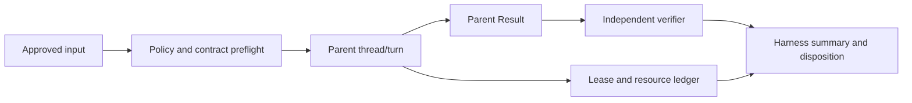

# Codex Harness 内部设计基线

## 1. 文档定位

本文是 Codex Harness 的薄层内部设计说明，用于统一产品意图、脚本层边界、设计原则、用户流和上下文索引；它不是运行时配置、协议 schema、Impl-Package 状态源或验收结果存储。

机器可读的策略字段和值只存在于 `skills/codex-harness/assets/codex-harness-runtime-policy.v0.json` 及其相邻 JSON Schema；本文不复制配置正文，也不应被脚本解析为默认值。

本文不保存实验 thread id、过程执行记录、旧版本 probe 细节或详细外部资料索引；实现和验收应直接读取当前 canonical contract、代码和目标环境证据。

## 2. PRD

### 2.1 问题

Agent 能够自主规划、委派和汇总，但如果没有外层边界，任务范围、权限、上下文连续性、结果真实性和失败恢复会依赖不可审计的自然语言约定。

当前需要一个宿主中立的 Harness，把一次有界工作包装成可启动、可恢复、可验证和可处置的执行单元，同时保留高能力父 agent 对实现方法和内部协作的自主权。

### 2.2 用户与场景

- Owner 需要知道一次 agent 执行是否在授权范围内、证据是否可信、失败应由 Harness 重试还是交给 owner。
- 主控 agent 需要在明确的任务、路径、沙箱和验收边界内自主选择实现方式，包括是否使用 native subagents。
- Impl-Package 执行方需要把批准的 Decision/Spec/Plan/Composition 映射成可审阅的 Harness stage，而不产生第二套 package 状态源。
- 维护者需要在 continuation、进程重启、超时、未知副作用和孤儿资源出现时保留可复核的状态与处置证据。

### 2.3 期望结果

- 不同独立任务默认使用新上下文；同一 work package 的重试或恢复才允许延续既有 thread，并受单写者约束。
- 父 agent 在边界内拥有实现和委派自主权；Harness 只介入权限、范围、资源、生命周期、证据和结果契约。
- Parent Result 只表达父 agent 的工作结论；Harness summary、独立 verifier、lease、资源账本和最终 disposition 由 Harness 负责。
- Impl-Package 3.2 的 revision binding、runtime-state、Composition、gate resolution 和 plan contract 被 canonical CLI 直接校验，不由 adapter 复制或猜测。
- 能力不足、证据缺失、配置漂移、未知副作用和 owner 决策请求均 fail closed，不自动提权或伪装成可重试失败。

### 2.4 范围

- App Server v2 的 parent thread/turn 启动、读取、恢复、分叉、中断和有限生命周期管理。
- canonical runtime policy 的加载、身份记录和已实现策略 seam；policy 值不散落在 prompt 或 Markdown 中。
- work package、Parent Result、独立 verifier、差异 allowlist、敏感原件授权和 Harness summary。
- continuation lease、资源账本、decision routing、cleanup/reconciliation 和 terminal disposition 的最小可审计接口。
- Impl-Package adapter 的 source snapshot 校验、可选 artifact 识别、Composition 读取和 fail-closed readiness。

### 2.5 非目标

- 不在 Harness 中重建 child scheduler，不绑定 child 的角色、数量、模型、prompt、拓扑或完成顺序。
- 不把 worktree 隔离描述为消除合并冲突、共享服务竞争或外部副作用。
- 不在本设计中承诺生产级多版本兼容、完整 MCP allowlist、逐 agent 预算或长驻 server 的全部清理能力。
- 不由 Harness 自动创建、合并或发布 worktree，也不直接写 Impl-Package gate、Decision、Spec 或 Plan 正文。
- 不把此文档、设计成熟度或父 agent 的自然语言自述当作 runtime enforcement evidence。

### 2.6 成功判定

一次执行只有在 Parent Result、仓库/runtime facts、独立 verifier、边界检查和当前 policy identity 一致时才能通过；缺少任一关键证据时报告未完成、失败或需要 owner，而不是乐观通过。

## 3. Script-layer Spec

### 3.1 运行边界

Harness 控制 parent；parent 自主完成实现和内部委派；validator 独立判断结果。外部 worker/crew 组合可以作为上层编排，但必须复用同一边界、lease、证据和处置语义，不能改变核心 Harness 的 parent-only 默认值。

### 3.2 组件职责

| 层 | 主要实现 | 责任边界 |
| --- | --- | --- |
| Protocol | `scripts/codex_harness_cli.py`、`scripts/run-codex-app-server-pilot.py` | Codex executable、App Server JSON-RPC、capability probe、parent lifecycle；不得把请求参数当作已生效事实 |
| Policy | `scripts/codex_harness_policy.py`、canonical policy JSON/Schema | 读取 canonical policy、校验结构与身份、拒绝未知或损坏输入；不在代码中复制策略值 |
| Runtime | `scripts/codex_harness_runtime.py` | ThreadLease、ResourceLedger、decision routing、reconciliation 和 terminal disposition 的最小运行时接口 |
| Parent control | `scripts/codex_harness_controller.py`、`scripts/codex_harness_crew.py`、`scripts/codex_harness_dispatch.py` | parent session、可选外层 worker、worktree/dispatch primitive；不拥有 child acceptance |
| Package adapter | `scripts/codex_harness_impl_package_compat.py`、`scripts/codex_harness_prepare.py` | 复用 Impl-Package canonical grammar，读取 approved snapshot，生成待审阅 readiness；不复制 sidecar schema |
| Package runner | `scripts/codex_harness_package.py`、`scripts/run-codex-harness-package.py` | 校验固定 source、binding、Composition、依赖、worktree、Parent Result、diff 和 verifier，再执行一个 parent stage |
| Impl-Package state | `skills/impl-package/scripts/impl_package_state.py` | package-local revision binding、runtime-state、projection、gate index 和 contract validation 的唯一机器事实源 |

### 3.3 输入与输出契约

- **Policy identity**：每次运行记录 canonical policy/schema 的路径、版本、hash 和 maturity；具体字段和值由 JSON/Schema 负责。
- **Work Package**：由 Harness 生成，绑定 package snapshot、attempt、stage、路径、沙箱、网络、敏感原件和 verifier 约束；父 agent 不能扩大其范围。
- **Parent Result**：父 agent 只报告完成结论、工件、验证、发现和 owner decision 请求；Harness 不要求父 agent 伪造 lease、资源账本或最终处置字段。
- **Harness summary**：由 Harness 合并 Parent Result、仓库/runtime facts、独立 verifier、policy identity、资源账本和 disposition；它是对外 acceptance 的边界。
- **Continuation lease**：以 thread identity、run identity、owner token、heartbeat 和 expiry 约束单写者；跨独立任务不得复用 thread 历史。
- **Resource ledger**：append-only、hash-chained、可验证的 run/thread/turn/process/lease/disposition 证据；terminal disposition 后不得继续追加普通事件。
- **Decision routing**：同一授权范围内的纠偏可由 Harness/parent 继续；范围、权限、不可逆外部副作用或验收歧义进入 owner route。
- **Impl-Package state**：adapter 只消费 canonical CLI 的结构化输出；缺 runtime-state、binding drift、gate mismatch、当前 terminal freeze 或不支持的 Composition 时 fail closed。

### 3.4 生命周期与失败语义

1. Preflight 先加载 policy，锁定 source snapshot，验证 profile、capability、package contract 和 worktree 状态。
2. Start 创建 parent thread/turn，并为本次 run 记录 policy identity、输入 hash 和资源起始事件。
3. Execute 允许 parent 在 work package 边界内自主实现、委派和汇总；Harness 只观察协议、期限、边界和资源状态。
4. Validate 读取 Parent Result，重新检查 artifact、diff、verifier、runtime facts 和必要的 gate/contract 证据。
5. Finalize 先完成 process/lease cleanup，再写唯一 terminal disposition；任何异常都保留 ledger、summary 和 owner 路由。
6. Retry 只针对 policy 明确允许且证据可解释的 transient/bounded failure；上下文不可信、配置漂移、未知副作用和 owner decision 不自动重试。

## 4. 设计原则

1. **父 agent 自主，Harness 守边界**：信任高能力主控在授权范围内作判断，Harness 不把过程偏好伪装成硬验收。
2. **结构化结果胜过自然语言**：父 agent 的过程报告是输入，不是最终 verdict；独立 verifier 和 runtime facts 具有更高证据权重。
3. **策略单一来源**：可配置值进入 canonical JSON/Schema；Markdown 只解释语义、证据和迁移边界。
4. **上下文和责任分区分开**：新任务使用新上下文；同一 work package 的 continuation 才可复用 thread；逻辑上不重叠的任务仍可能发生物理、合并或外部冲突。
5. **Fail closed**：不能证明策略、权限、binding、lease、结果或 cleanup 满足契约时，停止当前路径并报告明确状态。
6. **宿主中立**：抽象生命周期为 preflight、start、execute、validate、finalize、reconcile；具体 host 的 command、目录和 UI 语义只属于 adapter。
7. **最小事实层**：Impl-Package JSON 保存机器状态与指针，Markdown 保存判断和证据叙述；任何新字段都必须先证明可机械维护且不制造第二事实源。
8. **可恢复但不掩盖失败**：retry、resume、fork 和 fresh 都保留原始证据；恢复成功不抹除中断、残余资源或 owner decision。

## 5. 用户流

### 5.1 新 stage

Owner 固定 approved package commit 和 stage 边界；Harness 加载 policy、验证 Impl-Package 3.2 状态、生成 work package、启动 parent、收集 Parent Result、运行独立 verifier，最后输出 summary 与 disposition。

### 5.2 同一 work package 的 continuation

Harness 先验证 thread、profile、history continuity 和单写者 lease，再选择新 turn、resume、fork 或 fresh；lease 获取失败、配置漂移或历史不可信时停止当前 continuation 并保留证据。

### 5.3 Retry 与 owner decision

可解释的短暂失败按 policy 进入下一次 bounded attempt；scope、authority、外部副作用或验收歧义生成 owner decision request，等待 owner 后由同一 logical task 按新 turn 或显式 fresh path 继续。

### 5.4 Impl-Package adapter

Adapter 在 detached source snapshot 中调用 canonical `validate --committed` 与 `resolve-gate`，读取当前 D/S/P、Composition、attempt artifact 和可选 decision/DAG/ticket；合法 no-DAG 表示“不适用于自动 stage preparation”，不应被标为 schema invalid。

### 5.5 Failure、cleanup 与 reconciliation

超时、中断、ledger integrity error、lease conflict、未知副作用和 verifier failure 都保留原始资源证据；cleanup 只处理 Harness-owned 资源，未知或外部资源转 owner route，不静默删除或提权。

## 6. Contract / context index

| 权威层 | canonical context | 使用规则 |
| --- | --- | --- |
| Runtime policy | `skills/codex-harness/assets/codex-harness-runtime-policy.v0.json` + adjacent JSON Schema | 唯一的策略字段和值来源；加载、hash、版本和 maturity 由 loader 处理 |
| Harness semantics | 本文 | 解释 PRD、脚本边界、原则、用户流和路线图；不作为机器输入 |
| Host instructions | repository `AGENTS.md` 与 host-specific entry files | 提供仓库级安全、安装和验证约束；不由 Harness 重写 |
| Parent profile | `.codex/harness/parent.toml` 或调用方显式 profile | 提供 parent role/model/effort 等输入；effective config 必须通过运行时 projection 验证 |
| App Server protocol | 目标 Codex release 的 App Server v2 contract | 外部协议权威；启动前做 capability/version probe，未知能力必须降级或 fail closed |
| Impl-Package composition | `skills/impl-package/references/impl-package-composition-contract.md` | Decision/Spec/Plan/Composition、生命周期和 gate 语义的跨层权威 |
| Impl-Package state | `skills/impl-package/references/impl-package-state-schema.md`、`impl_package_state.py` | `.impl-package/` sidecar、projection、binding、runtime-state 和 gate index 的机器权威 |
| Package adapter/runner | `scripts/codex_harness_prepare.py`、`scripts/codex_harness_package.py` | 只适配和验证，不改写 package 正文或另建 schema |
| Acceptance evidence | Parent Result、Harness summary、独立 verifier、ledger 和 package ER/gate | 由各自 owner 产生；任何单一 agent 自述都不能替代完整证据链 |

## 7. Maturity 与路线图

### 7.1 内部 maturity vocabulary

`design_baseline` 表示策略语义已审核、已编码到 canonical policy 并通过 schema 校验，但尚未证明所有相关入口都加载、应用、拒绝和记录该策略。

`runtime_enforced` 表示同一 policy version 在所有声明的相关入口中被加载和强制执行，允许/拒绝路径、failure path、独立 verifier 和 policy-specific evidence 均闭合。

从 `design_baseline` 到 `runtime_enforced` 是整份 policy 的 owner-approved atomic transition；局部代码接入、单个 fixture 通过或文档更新都不能单独提升 maturity。

### 7.2 路线图

- **Design baseline**：保留 canonical policy、Schema、父边界、Parent Result、package adapter、lease/ledger seam 和 deterministic fixtures；所有未闭合路径保持显式未完成。
- **Runtime enforcement closure**：补齐所有受支持入口的 policy load/guard、continuation lease、terminal cleanup、orphan reconciliation、failure-path evidence 和 reviewed verifier profile。
- **Completion audit**：用当前 revision、worktree、环境和独立证据审计每项 acceptance；只有 owner 批准的原子变更才能更新 maturity。
- **后续风险扩展**：按真实需求再评估版本兼容矩阵、MCP/tool allowlist、成本/时间预算、写密集 worktree 协调和 child-level orchestration；这些不是当前默认契约。

### 7.3 本文的退出条件

当脚本层契约、canonical policy、Impl-Package state、独立 verifier、失败恢复和资源处置均有同 revision 的可复核证据后，owner 才可决定是否把 policy maturity 提升为 `runtime_enforced`；在此之前，本文只作为设计上下文，不作为完成声明。
