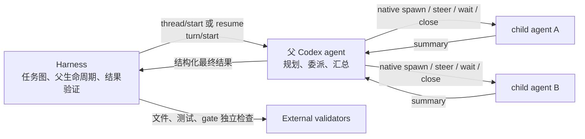
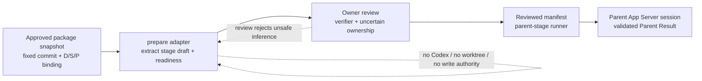
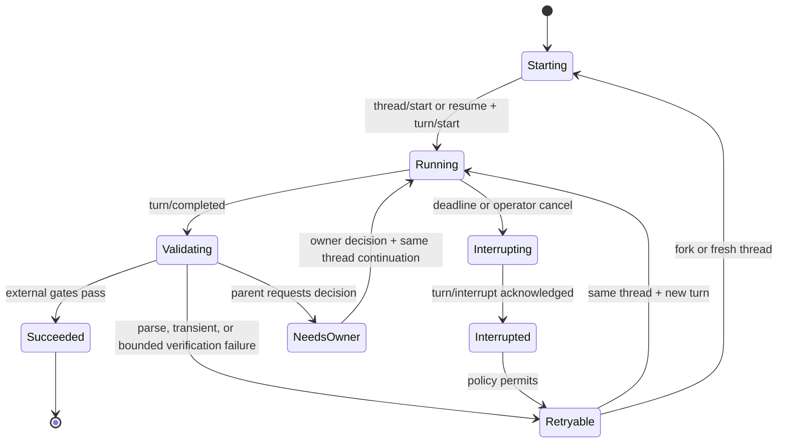

# Codex Harness POC：目标、调研结论与 Sources Index

## 文档状态

- 状态：POC 设计基线 v0.3，尚非生产规格。
- 最后核验：2026-07-18。
- 本地验证版本：`codex-cli 0.144.4`，Windows，Codex App Server stdio/JSON-RPC。
- 维护约定：本文件是 `codex-harness` Skill 的架构语义与证据事实源；可配置策略的字段和值以 `codex-harness-runtime-policy.v0.json` 及其 JSON Schema 为 canonical source，不在 Markdown 中复制另一份配置正文。后续先完善设计、canonical policy 和证据，再用它们驱动 Skill 规则、脚本与 eval 的完善。

## 术语定义

以下术语是本仓库 `codex-harness` 的内部 canonical vocabulary，不是 Codex、OpenAI 或任何行业标准的成熟度分级；它们只描述某一版 canonical runtime policy 被运行时采用和强制的程度，不能用于推断整个 Harness、某个 parent agent 或项目已经生产就绪。

- **Canonical runtime policy**：带版本、可机器解析的策略值来源。它定义上下文、委派、任务分区、决策路由、验收、生命周期和边界失败的预期行为；JSON Schema 只校验其结构和值域，架构语义和证据仍以本设计文档为准。
- **`design_baseline`**：策略语义已审核、已编码为 canonical JSON、且通过 Schema 校验，但 runner 尚未证明会在所有相关路径加载、应用和拒绝违反策略的行为。它可以指导设计和实现，不能作为“该策略已在运行时生效”的证据。
- **`runtime_enforced`**：对该 policy version，运行时会加载并校验策略，在全部相关执行路径应用其约束，并对允许与拒绝路径保留直接验证证据。只要任一声明的策略字段仍只是文档约定、被执行路径绕过，或缺少相应验证，policy 都不得标为 `runtime_enforced`。
- **Maturity transition**：从 `design_baseline` 升为 `runtime_enforced` 是整份 policy 的原子状态迁移，不是对单个字段的乐观标记；必须先完成实现、deterministic validation 和证据复核。局部实现可以在路线图中记录，但不改变该 policy 的 maturity。

## 目标

构建一个真正可程序化的 Codex Harness：外层程序通过 Codex App Server 启动和持续控制父 agent，会话内的任务拆分与 subagent 编排仍交给父 agent；Harness 用明确输入、结构化父结果、独立验证和可恢复生命周期把概率性的 agent 工作包装成可审计的执行单元。

我们希望信任高能力父 agent 的判断并保留 Codex 原生 agent 能力，而不是在外层重新实现一个与模型争夺控制权的多 agent scheduler。Harness 通过 thread-level developer instructions、模型/推理强度、Skills、AGENTS.md 和 work package 为父 agent 绑定角色、授权边界和交付约束；父 agent 在边界内自主选择实现、委派和协作方式。Impl-Package 继续用适合人工审阅的 Decision/Spec/Plan/DAG 与 revision binding 定义语义图，Harness 用机器可校验的 JSON/TOML 契约补齐进程级控制、协议适配、超时、重试、恢复和可观测性；两者都把“agent 如何做”与“系统如何判定边界和结果”解耦，载体不同不改变该原则。

### 成功形态



### 当前非目标

- Harness 不给 child agent 绑定角色，也不直接调度或验收每个 child agent。
- 不先实现 child 级取消、重试、断点续跑或清理协议。
- 不在 POC 阶段承诺跨 Codex 版本兼容。
- 不先实现 MCP 白名单、每 agent token budget 或精细时间预算；只有出现真实安全、成本或可重复性需求时再提升优先级。
- 不支持没有 worktree 或明确文件所有权的并行写入。
- 不把 Desktop UI 自动化作为 Harness 的主控制面。

## 已接受的架构决策

### 1. Harness 始终对接父 agent

Harness 负责启动父 thread、提交 turn、监听事件、解析父结果和运行外部 gate。父 agent 负责原生 subagents 的选择、任务说明、并发、等待和结果汇总。这个边界已经足以形成有用的 POC，也让 Codex 自身的 agent 能力继续演进而不迫使 Harness 跟随每个内部工具细节。

### 2. 验收父结果，不控制 child 的完成方式

当前硬验收对象是父 agent 的结构化最终结果及其指向的外部证据。child thread id 和活动流只可用于调试、审计和性能观察；父 agent 是否生成 child、生成几个、采用什么角色/模型/prompt、如何组织协作以及是否逐一关闭，都不是默认 acceptance gate。

如果未来某类任务必须证明职责隔离或独立审查，Impl-Package/Skill 可以把“父结果中必须包含哪些独立证据”写进任务契约；它约束的是父 agent 必须交付的证据，不规定父 agent 必须怎样组织 child。只有安全、权限、mutation、deadline、成本/并发或结果契约等边界被触及时，Harness 才介入。

### 3. App Server 是主控制面

`codex exec --json` 适合一次性非交互执行和事件消费，但当前没有提供足够可靠的 child provenance 与 durable thread 生命周期控制。App Server v2 暴露 thread/turn API、持久 thread id、事件流、read/resume/fork/interrupt，因此更适合作为 Harness 边界。

### 4. Impl-Package 负责语义图，Harness 负责运行控制

Impl-Package 现有体系已经覆盖 implementation plan、task/DAG、依赖、并发价值、review 和 completion gate。Harness 不复制这些语义；它把一个可执行 stage 映射为父 agent 的 thread/turn，执行超时和重试策略，收集父结果并触发已有外部 gate。

### 5. 只绑定父角色，先固定父模型和推理强度

Harness 只配置父 agent：通过 `thread/start` 的 developer instructions、model/config、适用的 Skill/AGENTS.md 与 work package 形成父执行角色。当前 POC 用 `.codex/harness/parent.toml` 保存父 profile，再由 Harness 显式映射到 `thread/start`；它刻意不放在 `.codex/agents/`，因为后者的 Codex 原生语义是 spawned child 的配置目录。当前先把父角色说明、模型与推理强度做成明确输入；MCP 白名单与 token/time budget 后移。sandbox 和 approval 始终由 Harness 的父运行时边界控制。child 配置是父 agent 的内部选择，不进入 Harness 角色模型。

### 6. 介入条件必须是边界，不是过程偏好

Harness 可以限制父运行的权限/沙箱、允许读写路径、mutation authority、外部副作用、deadline/cancel、最大并发/成本和最终结果 schema，也可以在这些边界被违反时中断、拒绝或重试。除此以外，Harness 不因父 agent 没有使用预想工具、没有生成 child、生成了不同数量的 child 或采用不同任务分解而判失败。

### 7. 边界内采用自主委派，不逐步遥控父 agent

Harness 预授权父 agent 在已声明边界内自主完成任务，包括自行决定是否委派、如何拆分责任、怎样向 worker 提供指导以及何时汇总。父 agent 和 worker 的过程报告可以作为高价值判断输入，但不能替代结构化 Parent Result、外部 verifier 或安全边界。放宽委派授权的含义是减少逐操作审批和过程指令，不是允许父 agent 扩大任务范围、权限、外部副作用或验收口径。

### 8. 任务上下文、责任分区和物理隔离分开建模

不同任务从新上下文开始；只有同一 work package 的纠偏、重试或进程恢复才允许延续既有 thread 历史，并且恢复前仍要验证角色、配置和 history continuity。同一持久 thread 只能有一个 controller 写入，后续实现必须用 lease 或等价机制阻止并发驱动。

“任务不冲突”只表示调度前按责任边界把任务拆成默认不重叠的工作单元；它不宣称 worktree 能消除合并冲突、共享服务竞争或外部副作用。写任务仍需要独立 workspace，责任确有重叠时必须显式协调，外部副作用必须受单独边界约束。

### 9. Crew 是 opt-in 外部 worktree worker 工作流，不改变核心 Harness 默认边界

主会话通过统一 parent controller 启动一个持久 parent thread，并确认 parent 提出的 Lite/Full 模式；它只负责面向用户的交付、转发和决策，不直接创建 worker。parent 根据确认的 profile 调用独立的 App Server worker session，在多个 worktree 上处理已经分区的工作单元。它复用底层 CLI/JSON-RPC 能力；这不是对 Codex native child topology 的复制性验收，也不替代核心 Harness 的“外层只控制父 agent”默认边界。Lite 不加载 Full-mode runtime policy、policy-bound ledger 或 Impl-Package；parent controller 仍对所有 continuation 使用单写者 lease 并记录 dispatch binding，完整 Crew 在共享 dispatcher 之上再组合 canonical policy、ledger、package、verifier 和 review seams。

worker 的 `needs_parent`、`needs_owner` 或失败结果不终止整个用户请求。parent 先在既有授权内判断并向同一 logical parent task 发送 correction；只有 scope change、authority expansion、不可逆外部副作用或验收歧义才通过主会话向 owner 请求决策。owner 决策由主会话转发后，同一 parent thread 通过新 turn 或 `thread/resume` 继续，而不是被一个无关的新任务替代。独立 worker task 仍必须使用新 thread，且 worktree 并不消除最终 merge、共享服务或外部副作用冲突。

### Canonical runtime policy

上述可配置决策的 canonical 表达位于 `assets/codex-harness-runtime-policy.v0.json`，字段约束位于 `assets/codex-harness-runtime-policy.schema.json`。当前 policy 的 `maturity` 是 `design_baseline`：它固定已接受的策略语义，App Server/package/resume 入口已形成部分 loader、lease/ledger seam，但尚未证明所有字段、失败路径和入口均闭合；术语的准确含义见本文档的“术语定义”，实现和验证完成前不得把 canonical 配置误报为 `runtime_enforced`。Markdown 只解释架构含义、证据和迁移边界，具体策略值只修改 canonical policy。

## 调研与实测结论

### 已由官方资料确认

- 当前本地 Codex 支持原生 subagent 工作流，并能通过直接 prompt、AGENTS.md 或 Skill 指令触发委派。
- Codex 支持项目级 custom child agents，但这是父 agent 可使用的原生能力，不是本 Harness 必须配置或验收的对象。
- 父 Codex 负责 spawn、steer、wait 和 close agent threads；主 thread 收集 child 结果并形成最终响应。
- App Server 使用双向 JSON-RPC 2.0，支持 stdio JSONL，并提供 `thread/start`、`thread/read`、`thread/resume`、`thread/fork`、`turn/start`、`turn/interrupt` 和事件通知。
- App Server 返回的 subagent thread 元数据在可用时包含 `parentThreadId`、`agentNickname` 与 `agentRole`；持久事件中的 `subAgentActivity` 可携带 child thread id。
- `thread/items/list` 和 paginated history 属于实现可能尚未覆盖的能力；官方 README 明确允许实现返回“不支持”。Harness 必须做 capability/version probe 或可靠降级。

### 本地 POC 已验证

- App Server 启动的父 session 能通过父 agent 的原生协作工具生成 child agents。
- 父 thread id：`019f6c06-3b1c-75c2-bd05-8bb0ba086f1d`。
- 从父历史的 `subAgentActivity.agentThreadId` 读取到两个持久 child thread id：`019f6c06-9b64-7371-94a4-ad252941f654` 与 `019f6c06-e2a9-7723-a9c7-2805bbbc158e`。
- 两个 child 均可通过 `thread/read(includeTurns=true)` 读取，且 `parentThreadId` 指向同一父 thread；这证明 App Server session 可以 spawn 可追踪的 native child threads。
- 本地运行时对 `thread/items/list` 和 paginated history 未提供可用实现，POC 已降级到 `thread/read`。
- `codex exec --json` 的 spawn 输出不足以稳定获得 child thread id；因此它保留为对照入口，不作为主 Harness 协议。
- 在 `codex-cli 0.144.4` 的实际 probe 中，`thread/start`、`thread/resume`、`thread/fork` 和 `thread/read(includeTurns=true)` 的 thread projection 只观察到 `modelProvider=openai`，没有具体 model 或 reasoning-effort 字段；但 `config/read(includeLayers=true)` 能返回 effective `model` 与 `model_reasoning_effort`。因此 POC 可以用“effective config projection + canary/history continuity + resume/fork/fresh”证明父 profile 恢复，不能把请求参数或 Parent 自报配置当作事实；若 `config/read` 不可用或与目标 profile 不一致，必须 fail closed。

### 观察到但不构成验收要求

- 实测 child 元数据中 `agentRole` 为 `null`，昵称为自动生成值。这不再是待修复的角色绑定缺口，因为 Harness 不给 child 绑定角色；它只说明 child metadata 适合作为诊断 telemetry，不能作为父任务验收依据。
- 已验证父 agent 的 canary、history continuity、resume/fork/fresh fallback，以及 `config/read` 对 effective model/effort 的投影；strict AC-7 在最新 probe 中通过。需要保留的版本差异是：具体 model/effort 不在 thread object 本身出现，而来自 effective-config seam。
- POC runner 已覆盖 parent-result strict validation、stage timeout/interrupt、append-only retry ledger、resume/fork/fresh 选择和隔离写入 pilot；这些能力尚未提炼为稳定公开 API，session cleanup 的长期驻留策略和 Codex 版本兼容矩阵仍待后续 package。
- 已验证隔离环境中的允许写入、越界 diff 拒绝、取消/失败后主工作树无污染；真实多 writer 冲突策略仍不在本 POC 范围内。

## 父结果契约草案

POC 下一步应要求父 agent 在最终响应中只输出一个可机器解析的对象。字段可调整，但语义应保持：父 agent 报告“做了什么和有哪些证据”，Harness 独立判断“是否通过”。

```json
{
  "schema_version": "codex-harness.parent-result.v0",
  "run_id": "harness-generated-id",
  "stage": "impl-package stage or poc stage",
  "status": "succeeded | failed | needs_owner | interrupted",
  "summary": "concise parent-owned conclusion",
  "artifacts": [
    { "path": "repo-relative path", "purpose": "what this artifact proves" }
  ],
  "verification": [
    { "command": "exact command", "exit_code": 0, "claim": "bounded claim" }
  ],
  "findings": [],
  "owner_decisions": [],
  "retry_hint": "none | same_thread | new_turn | fork | fresh_thread"
}
```

Harness 至少需要执行以下检查：JSON/schema 可解析；`run_id` 与当前运行一致；artifact 路径在允许范围内且实际存在；关键验证命令由 Harness 重新运行或由可信 gate 复核；`needs_owner` 不被误判为失败重试；`succeeded` 不因父 agent 自述而自动成立。

## 预配置与 Package Adapter 设计

### 设计目标

Harness 的长期复用层应是父 profile、App Server 运行器、Parent Result 契约、敏感原件授权边界和验证器协议，而不是每个 Impl-Package 都重新手写一套调度脚本。新 package 的适配流程应只消费已批准、固定 commit 的 Decision/Spec/Plan/DAG/tickets，并产生一份可审计的草案 adapter；它不能把自然语言计划直接升级成执行权限。

### 三阶段边界



1. **生成**：`prepare-codex-harness-package.py` 固定 source commit，验证 revision binding 的 blob，并从 task contracts 提取 stage id、依赖、cohort、ticket、父角色、适用 Skills、候选允许路径和敏感原件提示，同时输出 readiness report。
2. **审核**：owner 必须为每个 stage 提供可独立、可安全重跑的 verifier；所有 `path_ownership_review` 项必须确认、收窄或重写路径边界。生成器未能解析明确代码路径时，只允许 package-local 证据路径；它不猜测写入范围。
3. **执行**：只有 reviewed manifest 可交给 package runner。runner 再次校验 source/D/S/P binding、依赖、worktree 清洁度、diff allowlist、Parent Result 与独立 verifier。父 agent 仍可自行使用 native subagents，但其 child 行为不作为通过依据。

### 推断规则与 fail-closed 规则

- 父角色是 stage 的执行约束；生成器可根据明确的“集成/正式 review/外部验收”语义选择 integration 或 manual-handoff parent role，其余保持独立的普通父 role。它不生成或绑定 child role。
- Ticket ID 从该 package 的 ticket 文件实际声明中解析，不假设 `DATEV-RULES-*` 等领域格式；没有单一明确归属的集成 stage 固定为 `integration-gate`。
- Cohort 只从 `Parallel Cohorts` 的首次所属声明读取；后续文案中作为并行邻居被提及，不会覆写 stage 的所属 cohort。
- 包含“真实/OCR/原件”语义的 stage 只标为 `on_demand`，实际读取仍要求执行命令显式传入 `--allow-sensitive-originals` 与受控 root；默认禁止复制原文、标识符或 payload 到 artifact、日志、提交或 Parent Result。
- `verification_commands = []` 是生成草案的安全默认值，意味着可以进行结构校验但不能通过执行验收。自动生成不等于已批准执行。

### 当前验证证据

- 通用 fixture 已证明 adapter 可处理非 DATEV ticket ID、普通实现、OCR 按需敏感 stage 和集成 review stage。
- DATEV approved snapshot `3cc2a9350d5820c236a352b7e1a756f13a837e27` 是首个 golden fixture：已验证 D5/S7/P6 binding、9 个 stage、T1/T2 初始 ready、T5/T6/T7 的 C3 归属、T7 按需敏感原件、T8 `integration-gate` 与 T9 外部验收 handoff。
- 生成的 DATEV manifest 已通过 package runner 的只读结构与 source-binding 校验；这不是 DATEV 实现或外部验收已经完成的证据。

## Impl-Package 映射

| Impl-Package 概念 | Harness 投影 | 当前状态 |
| --- | --- | --- |
| approved plan / ticket / DAG | 父 agent 的 work package 与 turn 输入 | 已有体系，可接入 |
| fixed approved package snapshot | draft adapter + readiness report | v0.1 已实现；草案必须经 verifier/ownership review |
| task dependencies | 哪些父 stage/turn 可以启动 | 已有体系，可接入 |
| parallelizable bounded tasks | 父 agent 获准使用 native subagents | 已验证 native spawn，可接入 |
| parent execution role | thread developer instructions + model/effort + Skill/AGENTS.md + work package | 请求映射已验证；POC 通过 `config/read` effective projection、canary 与 history continuity 证明实际 model/effort，thread object 本身仍只提供 provider |
| task review / completion gate | 父结果证据 + Harness 外部 validator | POC adapter/validator 已验证；稳定 API 待提炼 |
| retry / timeout | 父 stage/turn 运行策略 | POC runner 已验证 interrupt、retry ledger 与 fresh recovery；长期 controller 待设计 |
| continuation | `thread/resume`、新 turn 或 `thread/fork` | API 存在，选择策略待验证 |
| lifecycle log | thread/turn id、事件、父结果、validator 结果 | POC 部分具备 |

## 推荐的生命周期设计

### 控制单位

把“一个父 agent 执行一个有界 stage”作为最小可重试单元，而不是把每个 child agent 当作 Harness job。每个 run 记录 `run_id`、Codex 版本、配置摘要、父 thread id、turn id、输入 hash、父结果、验证结果、超时/中断原因和恢复决策。

不同 stage 或其他独立任务不能因为复用同一个命名 worker 而继承旧 thread 上下文。同一 stage 内的 continuation 可以选择新 turn、resume、fork 或 fresh thread，但选择和权限必须来自 canonical runtime policy；涉及既有 thread 时先取得单写者 lease，并把 lease、worktree、进程与处置状态写入 run resource ledger。

### 状态机草案



### 超时和取消

Harness 的 deadline 作用于父 turn。到期时先调用 `turn/interrupt`，等待有限 grace period 收到 terminal event，再终止或重启 App Server 进程。不要等待 parent 在超时后逐一优雅关闭 child；已知 issue 显示 interrupted child 与 `close_agent` 可能形成 stale slot 或挂起。

### 重试

- 同一 thread 新 turn：适合输入完整、上下文仍可信、失败原因可通过明确 correction 修复的情况。
- `thread/resume`：适合进程重启后继续同一持久任务，但必须验证恢复后的 instructions/config 是否确实生效。
- `thread/fork`：适合保留已验证历史，同时从某个稳定边界分支；必须记录 fork 来源与边界。
- fresh thread：适合上下文污染、角色/配置变化、协议不兼容或 cleanup 不可信的情况。

所有重试都生成新的 attempt id，保持原始父结果和 validator 证据不可变；只有 transient/explicitly retryable failure 自动重试，`needs_owner`、安全拒绝、确定性测试失败和未知副作用状态默认不自动重试。

父 agent 请求建议时，Harness 先按 canonical policy 判断问题是否仍在已授权的同一任务内：可由 Harness 回答的执行纠偏继续同一任务；涉及 scope、authority、不可逆外部副作用或验收歧义的请求进入 owner decision。能力被沙箱或 policy 阻断时不得自动提升权限；边界拒绝也不能伪装成 transient failure 重试。

### 清理

POC 首选短生命周期 App Server 进程或有界 session 池，以进程边界回收潜在 stale agent registry。未来若采用长驻 App Server，需要 capability probe、loaded-thread/active-turn 盘点、background terminal 清理、stale child 检测、幂等关闭和进程重建阈值。不要直接编辑 Codex 内部持久状态作为正常清理方案。

## Sources Index

以下 Index 优先使用 OpenAI 官方文档和 `openai/codex` 主仓库。官方文档/源码用于定义能力，GitHub issues 只用于标记当前版本可能存在的风险；实现前应按固定 Codex 版本重新核验。

### 正式资料与源码

| Source | 类型 | 用途与摘要 |
| --- | --- | --- |
| [Codex App Server README](https://github.com/openai/codex/blob/main/codex-rs/app-server/README.md) | 官方主仓库文档 | App Server 的首要协议入口；说明 JSON-RPC transport、initialize、thread/turn 生命周期、事件流、read/resume/fork/interrupt、subagent thread 元数据和部分 capability 降级语义。Harness 的协议实现应首先对齐这里。 |
| [App Server v2 protocol definitions](https://github.com/openai/codex/blob/main/codex-rs/app-server-protocol/src/protocol/v2.rs) | 官方源码 | 请求、响应、Thread、Turn、Item 和 subagent 相关字段的权威类型参考；README 不足以确定字段形状时查这里。源码随 main 演进，生产实现应绑定 release/tag，而不是无条件跟随 main。 |
| [Codex MCP interface](https://github.com/openai/codex/blob/main/codex-rs/docs/codex_mcp_interface.md) | 官方主仓库文档 | 明确新集成应使用 v2 thread/turn API，并给出 App Server 与 MCP 暴露面的关系；也说明 `thread/start`、`turn/start`、`turn/interrupt`、`thread/list/read` 的定位。 |
| [Subagents / custom agents](https://developers.openai.com/codex/multi-agent) | OpenAI 官方文档 | 说明 Codex 原生 subagent orchestration、触发方式、agent thread、模型/推理强度和继承规则。它支持“父 agent 自编排，Harness 只控制父”的设计；custom child agent 配置不是 Harness 的验收依赖。 |
| [Codex config schema](https://github.com/openai/codex/blob/main/codex-rs/core/config.schema.json) | 官方源码生成 schema | 用于校验 Codex 配置字段、模型设置、MCP、sandbox 和其他 session 配置。Harness 应把 schema/version 检查用于启动前探测，而不是假定所有版本字段一致。 |

### 生命周期风险信号

| Source | 状态/性质 | Harness 启示 |
| --- | --- | --- |
| [`thread/resume` / `thread/fork` 首 turn 可能忽略 developer instructions override #19045](https://github.com/openai/codex/issues/19045) | GitHub issue，非契约 | resume/fork 后不能只相信请求已携带新 instructions；需要 canary、配置快照或 fresh thread fallback。 |
| [Persistent orphaned subagents and missing lifecycle controls #19197](https://github.com/openai/codex/issues/19197) | GitHub issue，非契约 | interrupted child 的持久状态与内存状态可能分歧；支持以父 turn/进程为恢复边界，并避免把 child close 当成无限等待的必经步骤。 |
| [`close_agent` may hang after child interruption #25426](https://github.com/openai/codex/issues/25426) | GitHub issue，非契约 | child cleanup 必须有 timeout；长驻 App Server 要有 registry 健康检查和进程重建策略。 |
| [Agent spawn slots may leak across persistent turns #18335](https://github.com/openai/codex/issues/18335) | GitHub issue，非契约 | POC 优先短进程或有界 session 池；生产化前加入多轮 soak test，验证 completed child 是否释放并发槽位。 |

### Source 使用原则

- README 和 release/tag 对应的协议源码定义“可依赖的接口”；main 只代表当前开发头。
- 官方产品文档定义用户可见的 custom-agent 行为，但仍需用目标 Codex 版本做 runtime verification。
- issue 是风险样本，不证明所有版本都受影响，也不能替代本地复现、回归测试或 changelog。
- 每次重要设计修订记录核验日期、Codex 版本和与上次相比的协议差异。

## 当前仓库 POC 资产

| 路径 | 作用 | 成熟度 |
| --- | --- | --- |
| `.codex/config.toml` | 限制 agent 并发/深度并记录中断消息 | POC |
| `.codex/harness/parent.toml` | 传统 Harness 显式加载的父角色、模型与推理强度 profile | POC；不是 native child agent 文件 |
| `.codex/harness/crew-parent.toml` | Crew 统一 parent 的 routing 与 Lite/Full execution profile | POC；不是 native child agent 文件 |
| `skills/codex-harness/SKILL.md` | 父 agent 的 Harness 角色与行为边界入口 | POC |
| `skills/codex-harness/assets/codex-harness-runtime-policy.v0.json` | 上下文、委派、任务分区、决策路由、验收与生命周期策略的 canonical 配置 | v0 design baseline；部分入口已消费，未闭合全路径 |
| `skills/codex-harness/assets/codex-harness-runtime-policy.schema.json` | canonical runtime policy 的机器可校验字段契约 | v0 design schema；loader 已接入，仍需全路径 evidence |
| `scripts/codex_harness_cli.py` | Codex executable discovery、App Server command construction、JSON-RPC stdio transport | 可被非 Harness 小任务直接复用的底层能力 |
| `scripts/codex_harness_crew.py` | 主会话控制一个持久 parent：routing、Lite/Full 确认、同 thread continuation 和 owner 决策转发 | Crew parent controller；所有 continuation 使用 lease，Full 再加载 policy/ledger seam |
| `scripts/codex_harness_dispatch.py` | parent 调用的 worktree 创建、fresh worker session、结构化 worker result 与基础状态 | Lite/Full 共享的底层 primitive；不持有 parent 或 owner 状态 |
| `scripts/codex_harness_controller.py` | 父 thread/turn 生命周期、Parent Result 解析、外部 artifact 检查和可选 child telemetry | Harness 控制层；不承载底层进程协议 |
| `scripts/run-codex-app-server-pilot.py` | 场景参数解析并转交 controller | POC 场景薄壳 |
| `scripts/prepare-codex-harness-package.py` | 从固定 approved package snapshot 自动提取 D/S/P binding、task contracts、cohorts、ticket 引用和敏感原件提示，生成待 review 的 adapter 与 readiness report | v0.1；生成草案，不自动补 verifier 或扩大路径权限 |
| `scripts/run-codex-harness-package.py` | 固定 commit 的 Impl-Package binding 校验、DAG ready-stage 投影和显式父 stage dispatch | v0.1；不自动建/合 worktree，不自动写 gate |
| `examples/datev-accounting-rules.pre-3.2-upgrade-fixture.toml` | 固定的旧 DATEV snapshot，用于证明 current-only adapter 在准备前拒绝旧 contract | upgrade fixture；不可作为执行 manifest |
| `scripts/run-codex-subagent-pilot.ps1` | `codex exec --json` 对照实验 | POC 对照入口，不作为主协议 |

## POC 路线图

### P0：形成可重复的父 Harness loop

- 定义并校验 parent result JSON schema。
- 固定父执行角色的 developer instructions、`model` 与 `model_reasoning_effort`；若 App Server 不返回权威 runtime projection，记录缺失并 fail closed。
- 让 App Server runner 记录版本、父 thread/turn、父结果和 validator 结果；`subAgentActivity` 只作为可选 telemetry。
- 实现父 turn deadline、`turn/interrupt`、grace period 和 App Server 进程兜底退出。
- 用只读任务做成功、结构化结果错误、超时和 retry 四类 deterministic test。

### P1：接入 Impl-Package 与 durable lifecycle

- 已实现：固定 package snapshot 的 D/S/P binding 校验、DAG ready-stage 投影、父 work package、Parent Result work-package hash/allowed paths/verifier seam，以及从任意符合约定的 package 自动生成 draft adapter/readiness。DATEV 9-stage package 是首个 golden fixture。
- 已验证：同一 DATEV snapshot 的 generated manifest 能被 package runner 重新校验并投影出 T1/T2 初始 ready stage；生成草案不会授予 verifier 或不确定路径的写入权限。
- 已形成最小 runtime seam：上下文重置、边界内自主委派、责任分区、决策路由、thread lease、资源账本、promotion/cleanup 和权限阻断策略已进入 canonical JSON policy/schema；App Server/package/resume 入口已接入其中一部分，policy maturity 仍保持 `design_baseline`。
- 已实现并验证：package runner 与 App Server runner 加载 canonical runtime policy，记录 policy identity/resource ledger；resume pilot 使用 single-writer lease，policy/lease/ledger/routing deterministic fixtures 覆盖正常、伪造、冲突、篡改和 owner-route 场景。
- 待实现：将 continuation lease、terminal cleanup、orphan reconciliation 与失败路径证据闭合到所有受支持入口，并补齐 reviewed verifier profile 的结构化复用。
- 待实现：将 reviewed manifest 的 verifier profile 结构化复用，减少 owner 对重复命令的填写，同时保持每个 stage 的独立验收语义。
- 待验证：以 clean isolated worktree 执行一个非外部副作用的 generated-and-reviewed stage，验证生成→审核→父执行→独立 verifier 的完整闭环。
- 待验证：至少两个受支持 Codex 版本的 capability/compatibility matrix，以及多轮 soak（interrupted child、slot recovery、进程重启、session cleanup）。

### P2：按风险扩展控制面

- 在出现权限隔离需求时引入 MCP allowlist 和 per-role tool policy。
- 在成本或服务等级需要时引入 token/time budget。
- 为写入任务引入 worktree/文件所有权隔离、变更集验证和冲突恢复。
- 只有当父 agent 自编排无法满足明确 acceptance semantics 时，才评估 child 级外部调度。

## 下一项建议

下一项应补齐所有入口的 continuation lease、terminal cleanup、orphan reconciliation 和 failure-path evidence，并继续只强制当前能够证明的规则；只有 AC-11..AC-16 的 direct evidence、独立 verifier 和 policy-specific evidence 全部闭合后，才能把 policy maturity 提升为 `runtime_enforced`。reviewed verifier profile 继续作为并行的结构化复用项：把仓库常见的 typecheck、focused test、migration、build 等可安全重跑命令做成显式可选模板，再由 owner 为每个 stage 选择和补充。随后选取一个无外部副作用、拥有 clean isolated worktree 的 stage，完成一次 generated-and-reviewed manifest 的真实父执行闭环；DATEV 的外部 Test Mandant 验收仍留在其单独 gate 内。
