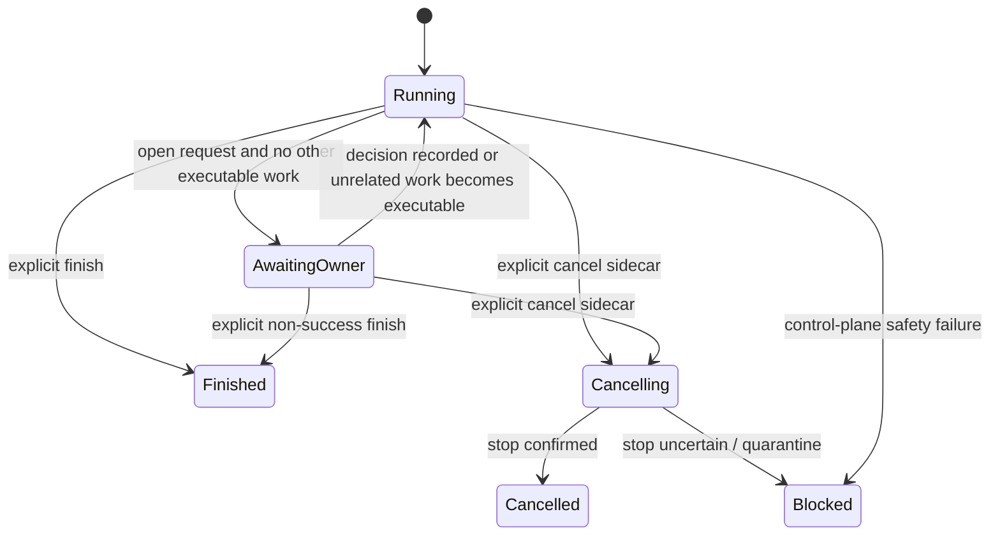

# Codex Crew continuation contract

`codex-crew-lite` 和 `codex-crew` 共享本合同。推荐的控制面由一个 Orchestrator run snapshot、assignment/result/verifier envelope、原子 cancel sidecar 和本地单写 controller 组成；具体字段和协议版本以 `assets/codex-crew.control.v0.5.schema.json`、`assets/codex-crew.orchestrator-turn.v0.3.schema.json`、`assets/codex-harness-runtime-policy.v1.3.json`、`assets/codex-harness-execution-profiles.v0.2.json` 及相邻 canonical Schema 为准。本文只解释稳定边界，不复制配置值。

## 控制域

```text
Owner <-> Broker <-> Orchestrator <-> Worker <-> Subagent
              ^             |
              +--可观测状态-+
```

Broker 负责用户侧对话、Owner decision provenance、canonical Crew 全景与 notification 展示和必要的 break-glass 线程管理；正常业务消息必须经过 Orchestrator。Broker 没有 canonical 规划权，不能自行固定 run、assignment、assurance、依赖、Crew intent 或 workspace；自己的推演只能作为非权威建议交回同一 Orchestrator。Orchestrator 是一次 run 的唯一业务 controller，拥有 assignment、依赖、Worker cohort、workspace/branch、Verifier、Owner request、纠偏、acceptance 和 finish 的控制权，但不直接写业务交付物。Worker 是完整 assignment 的交付责任人，可自主完成 package、implementation、review 和内部步骤并调用 Subagent；Subagent 只受所属 Worker 控制，不成为顶层通信对象或验收主体。

“一个 session 只有一个 controller”按控制域解释：同一 run snapshot 只有一个持久 Orchestrator controller identity，但允许在同一 identity 下进行多轮 continuation；同一 assignment 只有一个 Worker owner，同一 Worker thread 不能被两个同级 controller 并发驱动。当前 POC 是单控制器同步实现，不承诺多 controller daemon、热切换或跨任意 App Server 版本恢复。

## 独立维度

以下事实必须分别记录，禁止互相推导：

- `fresh context`：是否为独立 run/assignment 创建新的对话上下文；同一 assignment 的 bounded correction 可继续既有 Worker thread。
- `worker dispatch`：Orchestrator 是否启动一级 Worker；纯分析可没有 Worker。
- `write worktree`：当前同时活跃的写入 workspace 数量；它由同时写入者数量决定，不由 Issue、Worker 或 DAG 数量决定。
- `assurance`：单个 assignment 采用 Lite 或 Full；同一 run 可以混用，两者不是互斥的顶层模式。

Fresh Worker context 不等于 fresh worktree，run 也不等于 branch/worktree。Orchestrator 可在同一 run 内顺序或并行使用多个 workspace；当前单写者或多写者形态由 Crew intent 描述、由 observed panorama 证明，但二者都不自动创建物理资源。Workspace path、branch、base ref 和 `new`/`reuse` 由 Orchestrator 显式给出；`new` 必须落在 run-owned 根和受控 branch namespace，`reuse` 必须绑定同 run accepted `handoff_from`，并验证 commit、clean tree、祖先连续和验证证据。多个同时写入者必须使用不同 workspace，并声明完整互斥 write ownership；当前显式 cohort 并发已接线，跨 worktree promotion 仍是未闭合能力。

Orchestrator 的 read-only 只禁止直接写业务交付物；run snapshot、assignment、依赖、Worker lease、workspace 记录、dispatch/continuation 结果和 acceptance 属于控制面状态，由 Orchestrator 管理。没有代码 diff 的外部 mutation 必须转入 Owner gate 并 fail closed，不得通过空 commit、自然语言或伪造 artifact 越过验收。

## 状态与全景



Control snapshot 的 `crew.capabilities` 表达当前可调用角色、profile、workspace 策略和 cohort 能力；`crew.intent` 表达 Orchestrator 当前期望的只读、单写者或多写者形态；`crew.observed` 从 assignment、Worker、Verifier、Owner request 和 write lease 派生实际状态。三者不驱动流程。`broker_notifications` 记录重大调整供 Broker/Owner 观察，但普通 notification 不创建 approval gate；`terminal` 只在 Orchestrator 显式 `finish` 后形成。

## 四个控制动作

- `dispatch`：定义或修订一个有界 assignment，绑定目标、依赖、acceptance、profile 和 workspace intent；不创建 worktree、不启动 Worker。
- `control`：显式调用 `start_workers`、`continue_worker`、`run_verifier`、`accept` 或 `cancel_assignment`；普通纠偏不创建第二个 Orchestrator。
- `ask_owner`：创建 assignment-scoped 或 run-scoped request，将范围、权限、不可逆外部副作用或验收口径之外的决定交回 Broker/Owner，并保留 request identity 与原文 provenance。
- `finish`：显式提交 run 摘要、Worker/Verifier 结果、commit/diff、验证证据、风险和 terminal disposition。

控制面不为每个 Subagent 建立顶层协议，不实现 child scheduler，也不要求 agent 按固定 prompt 或调用顺序工作。`start_workers` 只运行 Orchestrator 明确列出的 cohort；任一 assignment 在 materialize 前的依赖、Owner gate、profile、workspace、完整 write ownership、资源冲突或 cohort 上限检查失败时，整个 cohort 保持零 worktree、零 Worker。Controller 等待该 cohort 收口，不在后台维护新的 scheduler。Orchestrator 可以在当前契约内自主选择拆分、Lite/Full、串并行、返工和重新分配；代码只检查可机械证明的硬边界。

## Assignment、结果和验收

每个写 assignment 至少绑定 run/assignment 标识、目标、非目标、自然语言 acceptance criteria、允许路径、依赖、Worker thread/workspace strategy、验收命令和结果状态。Package、implementation、review loop 和内部 T-step 在 ownership、权限、交付责任和独立 acceptance boundary 不变时属于同一个 Worker；责任边界实质变化时结束旧 assignment 并创建新的，同一边界内的澄清或 bounded correction 可继续原 Worker。

Worker result 必须绑定 assignment、提交范围、artifact、验证命令、风险和决策请求。Orchestrator 检查 HEAD、工作树 clean、diff 是否在允许路径内、命令退出码和 evidence provenance；自然语言完成说明不能替代这些事实。Worker `succeeded` 只进入 submitted，不自动启动 Verifier。Lite 可以在确定性证据充分时由 Orchestrator 接受；Full 必须由 Orchestrator 显式调用 controller 启动 fresh、只读、非递归 Verifier，并以 assignment revision、base/head commit 和 Worker result digest 固定 comparison。Orchestrator 只能消费 controller-owned attempt history；原 Worker 的 Subagent 和 Orchestrator 自报 verdict 不构成独立验收。`accept` 只接受 assignment，不自动产生 run terminal。

Worker-level acceptance 只表示一个 assignment 越过自身边界，不自动表示 run、merge、release 或 Owner 最终验收 closed。`needs_orchestrator` 表示当前契约内纠偏、证据澄清或资源协调；`needs_owner` 创建局部 Owner request，不自动阻断无依赖 assignment。只有 Orchestrator 显式 `finish` 且 terminal claim 与 canonical 事实一致时，run 才进入 finished。

代码 delivery 依赖和外部 operator/promotion 依赖是两张独立图：commit/验证 handoff 只由代码交付依赖决定；外部 mutation、merge、release 或生产预检由 Owner-gated 操作图决定。一个未授权的外部操作只阻断显式依赖它的 assignment，不能自动否定或锁死无依赖的代码 handoff。当前 Orchestrator 网络关闭，真实外部 API 的 read-only preflight 只能由人工/operator evidence 提供，不能描述为自动化 Orchestrator assignment。

没有有效结构化 `finish` 的 run 不产生权威 dispatch 或终态结论。正常 Broker、Orchestrator、Worker 和 Verifier turn 永不因时长自动 interrupt；Broker 每三分钟仅观察状态，普通轮询的结束不是 failure 或终态。只有 Owner 明确 `cancel` 才原子写 sidecar；active runner 停止新 dispatch、interrupt 当前受控 turn 并收集 terminal evidence。确认停止后写 `cancelled`；请求未处理只能报告 pending，停止未证实则写 `blocked/quarantine` 且资源不得复用。

Eval 是 Skill 行为回归而非运行时调度器；案例应分别表达结构化 `hard_invariants`、一旦发生即失败的 `forbidden_actions` 和不作为硬门的 `advisory_quality`，不把 Worker 数量、精确拆分或 turn 顺序当作控制器契约。Eval 资产版本按 `0.1` 步进。

## 取消、局部阻断和 legacy

取消先停止新的 dispatch，再 interrupt 当前受控 turn；只有能证明 Worker/受控进程已停止且 workspace 可安全处置时才写 `cancelled`。无法证明时写 `blocked` 并 quarantine 相关 workspace，禁止自动复用或启动重叠 assignment；恢复由人工或新的受控 run 决定。

Assignment-scoped request 只阻断自身及严格依赖下游；Broker 的 `owner_decision` 必须绑定 request id 和 provenance，只关闭目标 request，不自动 continue Worker。只有 run-scoped request 才阻断整个 run，顶层 `awaiting_owner` 只在有开放 request 且没有其他可执行工作时派生。Dispatcher 仅作为 Worker/workspace primitive，不能自动 merge、promotion、cleanup 或重新调度。

旧 parent/dispatch v1/v2、topology primitive 和旧 control/policy/turn asset 已物理删除。它们的历史状态不自动转换为新 Orchestrator snapshot；新入口应使用当前 control schema 和 Orchestrator CLI。Package parent-stage runner 保持独立 adapter 职责，不构成 Crew 的第二 scheduler。若 archival design 文档与 canonical Schema 或当前 controller 不一致，以后者为准。
