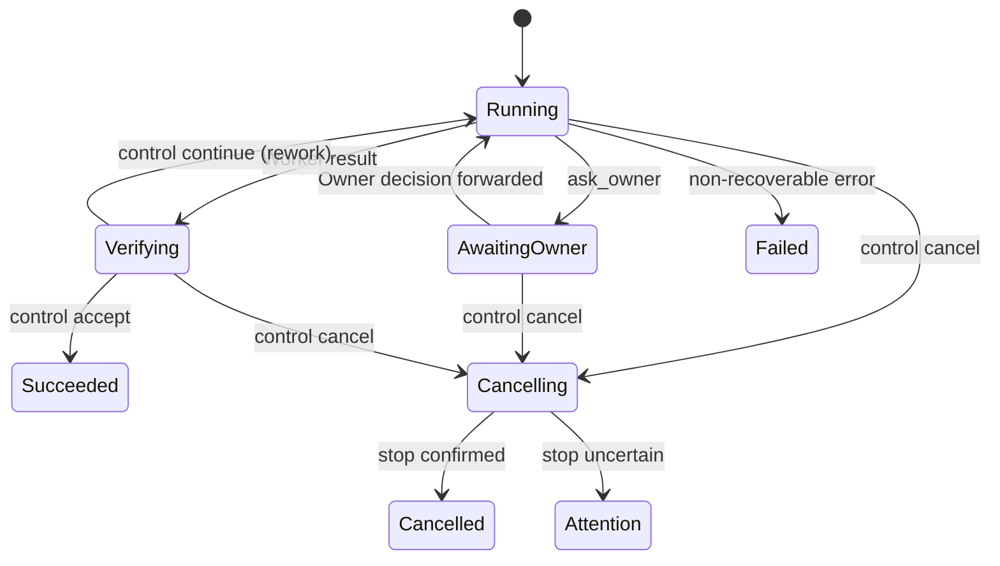

# Codex Crew continuation contract

`codex-crew-lite` 和 `codex-crew` 共享本合同。推荐的控制面由一个 Orchestrator run snapshot、assignment/result envelope 和本地单写 controller 组成；具体字段和协议版本以 `assets/codex-crew.control.v0.1.schema.json`、`assets/codex-harness-runtime-policy.v1.json` 及 canonical execution profiles 为准。本文只解释稳定边界，不复制配置值。

## 控制域

```text
Owner <-> Broker <-> Orchestrator <-> Worker <-> Subagent
              ^             |
              +--可观测状态-+
```

Broker 负责用户侧对话、Owner decision provenance、全局状态展示和必要的 break-glass 线程管理；正常业务消息必须经过 Orchestrator。Orchestrator 是一次 run 的唯一业务 controller，拥有 assignment、依赖、Worker、workspace、纠偏和 acceptance 的控制权，但不直接写业务交付物。Worker 是 assignment 的交付责任人，可自主调用 Subagent；Subagent 只受所属 Worker 控制，不成为顶层通信对象或验收主体。

“一个 session 只有一个 controller”按控制域解释：同一 run snapshot 只有一个持久 Orchestrator controller identity，但允许在同一 identity 下进行多轮 continuation；同一 assignment 只有一个 Worker owner，同一 Worker thread 不能被两个同级 controller 并发驱动。当前 POC 是单控制器同步实现，不承诺多 controller daemon、热切换或跨任意 App Server 版本恢复。

## 独立维度

以下事实必须分别记录，禁止互相推导：

- `fresh context`：是否为独立 run/assignment 创建新的对话上下文；同一 assignment 的 bounded correction 可继续既有 Worker thread。
- `worker dispatch`：Orchestrator 是否启动一级 Worker；纯分析可没有 Worker。
- `write worktree`：当前同时活跃的写入 workspace 数量；它由同时写入者数量决定，不由 Issue、Worker 或 DAG 数量决定。
- `assurance`：单个 assignment 采用 Lite 或 Full；同一 run 可以混用，两者不是互斥的顶层模式。

Fresh Worker context 不等于 fresh worktree。`worker_serial` 可以让不同 assignment 使用 fresh Worker context，并在前一 assignment 已提交、工作树 clean、提交祖先连续和独立验证证据存在时顺序复用一个 run-owned worktree。`worker_parallel` 才要求多个同时写入者使用不同 worktree，并声明互斥 write ownership。

Orchestrator 的 read-only 只禁止直接写业务交付物；run snapshot、assignment、依赖、Worker lease、workspace 记录、dispatch/continuation 结果和 acceptance 属于控制面状态，由 Orchestrator 管理。没有代码 diff 的外部 mutation 必须转入 Owner gate 并 fail closed，不得通过空 commit、自然语言或伪造 artifact 越过验收。

## 最小拓扑



Orchestrator 默认选择最小拓扑：`orchestrator_read_only` 只读且无 Worker；`worker_serial` 按依赖顺序启动 Worker，最多一个活跃写 worktree；`worker_parallel` 只在写 ownership 互斥且有明确并行收益时启动多个 ready Worker。一个 DAG 允许并行不等于默认并行；未 ready 的 assignment 不得预建 workspace。

## 四个控制动作

- `dispatch`：创建或继续一个有界 assignment，绑定 Worker、context、workspace 和依赖事实。
- `control`：继续（包括要求返工）、接受或取消同一 assignment；普通纠偏不创建第二个 Orchestrator。
- `ask_owner`：将范围、权限、不可逆外部副作用或验收口径之外的决定交回 Broker/Owner，并保留原文 provenance。
- `finish`：提交 run 摘要、Worker/Verifier 结果、commit/diff、验证证据、风险和 terminal disposition。

控制面不为每个 Subagent 建立顶层协议，不实现 child scheduler，也不要求 agent 按固定 prompt 或调用顺序工作。Orchestrator 可以在当前契约内自主选择拆分、Lite/Full、串并行、返工和重新分配；代码只检查可机械证明的硬边界。

## Assignment、结果和验收

每个写 assignment 至少绑定 run/assignment 标识、目标、非目标、允许路径、依赖、Worker thread/workspace、验收命令和结果状态。责任边界实质变化时结束旧 assignment 并创建新的；同一边界内的澄清或 bounded correction 可继续原 Worker。

Worker result 必须绑定 assignment、提交范围、artifact、验证命令、风险和决策请求。Orchestrator 检查 HEAD、工作树 clean、diff 是否在允许路径内、命令退出码和 evidence provenance；自然语言完成说明不能替代这些事实。Lite 可以在确定性证据充分时由 Orchestrator 接受；Full 还需要独立、只读、非递归 verifier，原 Worker 的 Subagent 不构成独立验收。

Worker-level acceptance 只表示一个 assignment 越过自身边界，不自动表示 run、merge、release 或 Owner 最终验收 closed。`needs_orchestrator` 表示当前契约内纠偏、证据澄清或资源协调；`needs_owner` 只表示四类 Owner 边界之一。

代码 delivery 依赖和外部 operator/promotion 依赖是两张独立图：commit/验证 handoff 只由代码交付依赖决定；外部 mutation、merge、release 或生产预检由 Owner-gated 操作图决定。一个未授权的外部操作只阻断显式依赖它的 assignment，不能自动否定或锁死无依赖的代码 handoff。当前 Orchestrator 网络关闭，真实外部 API 的 read-only preflight 只能由人工/operator evidence 提供，不能描述为自动化 Orchestrator assignment。

没有有效结构化 `finish` 的 run 不产生权威 dispatch 或终态结论。`turn/completed` 超时先进入 terminal/history reconciliation；没有 terminal envelope 时仅能报告 snapshot 和 git 边界中观察到的事实，并写 `blocked/quarantine`，除非有独立 acknowledgement，否则不得称为 `interrupted` 或复用该 run。

Eval 是 Skill 行为回归而非运行时调度器；案例应分别表达结构化 `hard_invariants`、一旦发生即失败的 `forbidden_actions` 和不作为硬门的 `advisory_quality`，不把 Worker 数量、精确拆分或 turn 顺序当作控制器契约。Eval 资产版本按 `0.1` 步进。

## 取消、下游阻断和 legacy

取消先停止新的 dispatch，再 interrupt 当前受控 turn；只有能证明 Worker/受控进程已停止且 workspace 可安全处置时才写 `cancelled`。无法证明时写 `attention` 并 quarantine 相关 workspace，禁止自动复用或启动重叠 assignment；恢复由人工或新的受控 run 决定。

上游 `needs_owner`、失败、未验收或取消未收口时，严格依赖的下游既不能预建 worktree，也不能启动 Worker。Dispatcher 仅作为 Worker/workspace primitive，不能自动 merge、promotion、cleanup 或重新调度。

旧 parent/dispatch v1/v2、topology primitive 和 Package parent-stage runner 是 legacy/transition 兼容路径。它们的历史状态不自动转换为新 Orchestrator snapshot；新入口应使用 control schema 和 Orchestrator CLI。若 archival design 文档与 canonical Schema 或当前 controller 不一致，以后者为准。
