# Codex Crew continuation contract

`codex-crew-lite` and `codex-crew` share this contract. The parent controller keeps the append-only event list and JSON state snapshot; `scripts/codex_harness_dispatch.py` keeps only its worker/worktree dispatch state. The dispatch manifest and examples are canonical structured resources under `../assets/`, not configuration duplicated in either Skill.

Each independent worker task starts with a fresh App Server thread and an isolated Git worktree. A worktree isolates its filesystem writes; it does not prove that parallel changes, shared services, remote state, migrations, or the later merge cannot conflict.

The interactive main session is the user-facing broker. It starts one durable parent thread, confirms the parent’s Lite/Full proposal, forwards ordinary corrections and owner decisions, and presents delivery. The parent is the only execution controller. “Continuous parent” means continuation of that same logical thread after a bounded worker result or owner decision; the App Server process itself may be recreated through `thread/resume`.

```mermaid
stateDiagram-v2
    [*] --> Routing
    Routing --> AwaitingModeConfirmation: parent proposes Lite or Full
    AwaitingModeConfirmation --> Running: main confirms; same parent resumes
    Running --> ParentJudgmentPending: worker needs_parent or failed
    ParentJudgmentPending --> Running: parent corrects or redirects within authority
    ParentJudgmentPending --> AwaitingOwner: parent identifies decision boundary
    Running --> AwaitingOwner: worker reports owner boundary
    AwaitingOwner --> Running: main forwards owner decision; same parent resumes
    Running --> AwaitingModeConfirmation: parent requests Lite to Full upgrade
    Running --> Completed: bounded work and checks complete
    Running --> Failed: non-recoverable execution failure
```

`needs_parent` and `needs_owner` are not terminal outcomes for the overall request. The parent first reasons from the issue, task evidence, and existing authority. For an ordinary correction it continues its own thread; for `needs_owner`, it sends a structured request through the main session only when the decision changes scope, authority, irreversible external side effects, or acceptance. Once the main session forwards an owner decision, the same parent thread receives a new turn; it must not be silently replaced with a fresh task.

Parent and worker effective execution profiles must come from the canonical profile binding and be recorded in state/evidence; resume or continuation must not silently drift the model or reasoning effort.

The low-level dispatcher intentionally does not delete worktrees. Cleanup/merge/promotion happens only after the caller has inspected status, diffs, verification evidence, and the chosen terminal disposition.
