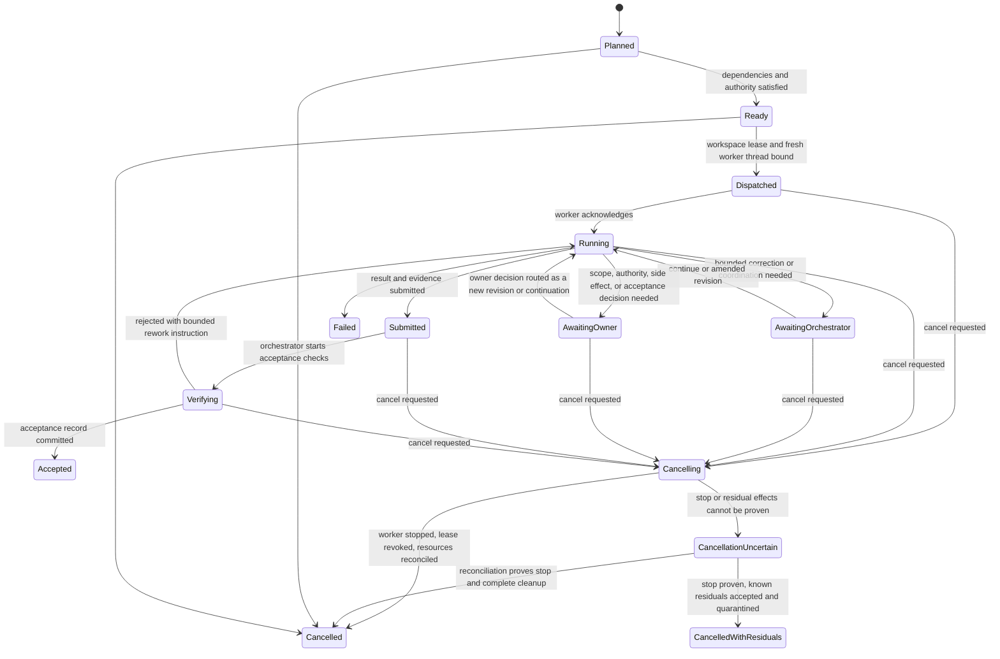

# Codex Crew Orchestrator/Worker 设计提案

## 文档定位

本文定义 Codex Crew 下一版的 Broker、Orchestrator、Worker agent 与 Subagent 控制权模型。它是待实施的设计提案，不是当前 runtime policy、协议 Schema 或已验证能力；现行 `parent-state.v2`、execution topology v0 和 dispatch v2 在新协议落地前仍保持原义。

本文只沉淀稳定语义、协议边界和迁移目标。模型名称、推理强度、并发上限、超时和其他可配置值应进入 canonical JSON/Schema，不在本文维护第二份配置。

## 目录

- [1. 产品目标](#1-产品目标)
- [2. 双通道模型](#2-双通道模型)
- [3. 角色与控制权](#3-角色与控制权)
- [4. Assignment 是核心责任单元](#4-assignment-是核心责任单元)
- [5. 四个独立执行维度](#5-四个独立执行维度)
- [6. Execution topology](#6-execution-topology)
- [7. Workspace lease 与串行复用](#7-workspace-lease-与串行复用)
- [8. 窄通信协议](#8-窄通信协议)
- [9. Worker lifecycle](#9-worker-lifecycle)
- [10. 验收与独立性](#10-验收与独立性)
- [11. Subagent 的不透明边界](#11-subagent-的不透明边界)
- [12. Canonical 状态与协议边界](#12-canonical-状态与协议边界)
- [13. 脚本层目标结构](#13-脚本层目标结构)
- [14. 迁移原则](#14-迁移原则)
- [15. 非目标](#15-非目标)
- [16. 设计验收场景](#16-设计验收场景)

## 1. 产品目标

Owner 只与用户侧 Broker 正常交流，同时能够观察整个执行程序；Broker 将业务请求和 Owner 决策交给一个持久 Orchestrator。Orchestrator 负责拆分、路由、资源控制、纠偏和验收，但不直接修改业务交付物。每个 Worker agent 独立拥有一个有界 assignment，负责其分析、设计、实现和证据，并可自主使用自己的 Subagent。Subagent 不进入顶层业务通信，也不成为顶层 canonical state owner。

目标结果：

- Owner 获得一个稳定的业务入口，不需要直接管理 Worker 或 Subagent。
- Orchestrator 成为一次 run 的唯一控制面，可以审计每个 assignment 的依赖、权限、workspace、状态和验收结论。
- Worker 成为实际交付责任人；所有业务写入都能追溯到明确 assignment、独占 workspace lease 和结构化结果。
- Full/Lite、模型 profile、执行拓扑和上下文新鲜度成为独立事实，不再相互推导。
- 串行 Worker 可以只使用一个活跃写 worktree；并行 Worker 只有在写 ownership 互斥且有明确收益时才获得多个 worktree。

## 2. 双通道模型

系统区分业务通信通道与可观测控制通道。

```text
业务通信：Owner <-> Broker <-> Orchestrator <-> Worker <-> Subagent
全局观测：Broker <- Orchestrator/assignment/worker/worktree/event telemetry
紧急控制：Broker --break-glass--> thread/run administration
```

正常业务消息不得绕过 Orchestrator。Broker 可以查看全局状态，但不能据此直接纠偏 Worker；只有在线程失联、controller 冲突、取消失效、资源泄漏或其他控制面异常时，Broker 才能以 break-glass 身份介入线程管理。每次 break-glass 操作必须记录原因、目标、授权来源和结果，且不能伪装成普通业务决定。

Break-glass 不把 Broker 提升为业务 controller。Broker 只能通过独立 admin control plane 原子递增 controller generation、撤销旧 controller lease、fence 旧 thread/process、记录 control incident，并启动或授权新的 Orchestrator recovery controller；旧 generation 的迟到消息和状态写入必须被拒绝。只有旧 controller 已被证明停止或隔离后才能恢复业务执行，不能在网络分区或控制权不确定时形成双 controller。

## 3. 角色与控制权

| 角色 | 拥有的控制权 | 明确禁止 |
| --- | --- | --- |
| Owner | 决定目标、范围、权限、不可逆外部副作用和验收口径 | 不直接调度 Worker/Subagent，不绕过 Orchestrator 修改 assignment |
| Broker | 维护 Owner-facing 对话、决策原文与 provenance，呈现全局状态，执行有记录的 break-glass 管理 | 不选择 Worker 拆分、实现方案或 acceptance，不把自己的转述冒充 Owner 决策 |
| Orchestrator | run 的唯一 controller；创建和修订 assignment，选择 assurance/profile/topology，控制依赖、workspace lease、纠偏、验收与 promotion | 不修改业务交付物，不替 Worker 补实现，不直接管理 Worker 的 Subagent |
| Worker agent | 一个 assignment revision 的唯一交付责任人；完成分析、设计、实现、自验和证据整理，自主管理自己的 Subagent | 不扩大 assignment，不直接联系 Owner，不控制同级 Worker，不自行取得外部 mutation 权限 |
| Subagent | 在 Worker 授权范围内完成局部分析、实现或验证 | 不接受 Broker/Orchestrator 指令，不写顶层 canonical state，不成为顶层验收主体 |

“一个 session 只能有一个 controller”按控制域解释：Broker 控制用户会话的呈现与紧急管理，Orchestrator 控制 run，Worker 控制 assignment，Subagent 只受所属 Worker 控制。同一 thread 或同一 canonical state 不得被两个同级 controller 并发驱动。

## 4. Assignment 是核心责任单元

Worker 绑定 assignment，而不是机械绑定 Issue。一个 Issue 可以拆成多个 assignment；多个责任边界一致、验证方式相同且紧密耦合的小 finding 也可以合成一个 assignment。

每个 assignment 至少声明：

- `assignment_id`、`revision`、所属 `run_id` 和来源需求。
- 明确的目标、非目标、输入、交付物和 acceptance contract。
- 写 ownership、外部资源、mutation authority 和敏感信息边界。
- 依赖、ready 条件、promotion boundary 和下游阻断规则。
- `assurance_mode`、`execution_profile`、`execution_topology` 和上下文策略。
- workspace lease、Worker thread、状态、消息游标、证据和 acceptance record 引用。

Orchestrator 可以在同一责任边界内发布新的 assignment revision。验收说明澄清、Owner 决策补充和同一 scope 内的纠偏可以由原 Worker 接收新 revision 后继续；写 ownership、权限、核心接口、交付责任或验收边界发生实质变化时，必须收口旧 revision 并创建新 assignment。是否更换 Worker 由上下文可信度、责任边界和失败原因决定，不由任意文字变化触发。

## 5. 四个独立执行维度

以下事实必须分别记录，禁止互相推导：

| 维度 | 含义 |
| --- | --- |
| Worker context | assignment 是否使用 fresh Worker thread；独立 assignment 默认 fresh，同 assignment 的 bounded correction 可以 continuation |
| Assurance mode | Lite 或 Full；决定设计、评审、验证与证据强度 |
| Execution profile | Worker 使用的 canonical model/reasoning/tool profile |
| Execution topology | Orchestrator 只读、Worker 串行或 Worker 并行，以及活跃 workspace lease 上限 |

Orchestrator 为每个 assignment 指定初始 assurance mode 和 execution profile。Worker 发现接口、迁移、权限、外部副作用、验收歧义或设计风险超出 Lite 边界时，必须请求 Lite 到 Full 的 promotion；Worker 不得自行降级。模式升级通常沿用同一 Worker 和 assignment revision，除非责任边界也发生变化。

## 6. Execution topology

| Topology | 业务执行者 | Worker dispatch | 活跃写 worktree |
| --- | --- | --- | --- |
| `orchestrator_read_only` | Orchestrator 仅做分析、路由或确定性只读检查 | 0 | 0 |
| `worker_serial` | 一个或多个按依赖严格串行的 Worker | 按 ready assignment 启动 | 最多 1 |
| `worker_parallel` | 至少两个 ready 且写责任互斥的 Worker | 按并发上限启动 | 等于获批的同时写入者上限 |

默认选择最小拓扑。没有已证明的并行收益时使用 `worker_serial`；Issue 数量、Worker 数量、fresh context 或 DAG 理论可并行性都不能单独证明需要多个 write worktree。

`orchestrator_read_only` 允许 Orchestrator读取仓库、Issue、状态和证据，并执行不会修改业务交付物的检查。任何交付性写入都必须转为 Worker assignment。

## 7. Workspace lease 与串行复用

写入型 Worker 必须持有独占 workspace lease，但 Worker、assignment 和 worktree 不建立永久一一映射。

- 并行写入的 Worker 必须使用不同 worktree，并声明互斥的文件路径和外部资源 ownership。
- 严格串行 assignment 可以顺序复用同一个 worktree；Orchestrator 只能在前一 assignment 已提交、工作树干净、提交祖先连续、独立验证证据存在且仍属于同一交付程序时转移 lease。
- fresh Worker context 不等于 fresh worktree。新 Worker 必须重新读取 assignment、当前提交和前序 acceptance evidence，不能继承上一 Worker 的隐式对话上下文。
- 尚未 ready 的 assignment 不得预建 worktree。上游 `needs_owner`、`needs_orchestrator`、失败或未验收时，严格依赖的下游不得取得 workspace lease或启动 Worker。
- Dispatcher 只实现 assignment/thread/worktree primitive，不自动选择拓扑、merge、promotion、cleanup 或重新调度。

Workspace lease 必须绑定 workspace id、assignment revision、Worker thread、base/hand-off commit、lease generation、fencing token 和 expiry。串行交接采用“停止旧 Worker 及其子进程 -> 撤销旧 generation -> 验证 hand-off commit、clean、ancestor 和 evidence -> 以新 generation 原子 acquire -> 再启动新 Worker”的顺序；任一步不能证明时 quarantine 该 workspace 并 fail closed。Dispatcher 和 controller 在启动 turn、接受结果及写 canonical state 前都必须校验 fencing token，旧 Worker 的迟到结果或残留进程不能重新取得写入资格。

## 8. 窄通信协议

自然语言可以作为消息正文，但只有结构化 envelope 和状态转换才是运行时事实源。建议的消息类型包括：

| 方向 | 消息 | 作用 |
| --- | --- | --- |
| Orchestrator -> Worker | `dispatch`、`continue`、`amend_assignment`、`request_evidence`、`accept`、`reject`、`cancel` | 建立或调整有界执行，索取证据，作出验收或终止决定 |
| Worker -> Orchestrator | `acknowledge`、`progress`、`needs_orchestrator`、`needs_owner`、`submit_result`、`failed` | 回执、状态、控制请求和结构化交付 |
| Broker -> Orchestrator | `owner_request`、`owner_decision`、`ordinary_correction`、`cancel_request` | 传递带 provenance 的用户输入 |
| Orchestrator -> Broker | `status_summary`、`owner_decision_request`、`delivery_summary`、`control_incident` | 向 Owner 汇报或请求决策 |

每条消息至少绑定 `run_id`、`assignment_id`、assignment revision、发送方角色、消息序号、correlation id 和预期状态版本。重复消息必须幂等；旧 revision 或旧状态版本的控制消息应 fail closed。

`needs_orchestrator` 用于当前契约内的实现纠偏、证据澄清或资源协调；`needs_owner` 只用于范围、权限、不可逆外部副作用和验收口径。Orchestrator 不得把自己的选择伪装成 Owner decision，Broker 也不得丢失 Owner 决策原文和 provenance。

## 9. Worker lifecycle



Orchestrator 是状态转换的唯一写入者；Worker 只提交事件和请求。取消进入显式 `Cancelling`：Orchestrator 停止新 turn，Worker fan-out 取消其 Subagent，controller 撤销 workspace lease generation，等待 cancel acknowledgement，核对 thread/process 和外部 mutation，再写 `Cancelled`。无法证明停止或残留处置时进入 `CancellationUncertain` 并生成 control incident，不得释放 workspace 给下一个 Worker。

`CancellationUncertain` 是非终态 attention 状态，由当前 Orchestrator 或经 break-glass fencing 后取得新 generation 的 recovery controller 执行 reconciliation。后来能够证明活动已停止且资源完全收口时转为 `Cancelled`；能够证明活动已停止但存在已知、已隔离且经适当 authority 接受的残留时转为 `CancelledWithResiduals`，原 workspace 和受影响资源保持 quarantine、永不复用。仍无法证明旧活动停止时保持 `CancellationUncertain`，不得在重叠 workspace、外部资源或 mutation scope 上启动新 attempt。

Worker thread 的非终态 crash 只有在 assignment revision、history continuity、controller generation 和 workspace fencing token 均可信时才可恢复；上下文不可信、controller 冲突或 assignment ownership 改变时必须 fresh/reassign。`Cancelled` 和 `CancelledWithResiduals` 都是终态，不能通过 resume 复活。无残留且原 contract 不变时，Orchestrator 可以创建新的 attempt；存在已知外部残留、权限变化或不可逆副作用时必须先取得 Owner 决策，再使用新的 assignment/attempt 和不重叠 workspace/resource lease，不能恢复旧 lease。

## 10. 验收与独立性

每个 assignment 必须产生独立的 acceptance record，至少绑定 assignment revision、Worker result、提交范围、artifact、验证证据、未解决风险、验收者和 disposition。自然语言“已完成”不能代替这些事实。

- Lite assignment 在 acceptance contract 完全确定、diff 边界清楚且确定性检查充分时，可由 Orchestrator 基于外部检查直接接受。
- Full assignment 除 Worker 自验外，默认创建独立 verification/review assignment，由另一个 Worker agent 复核；原 Worker 管理的 Subagent 不构成独立验收主体。
- Orchestrator 汇总实现 Worker 与 verifier Worker 的证据后作 `accept`、`reject`、`reassign` 或 `escalate` 决定。
- Worker-level acceptance 只证明该 assignment 越过自身 promotion boundary，不自动代表整个 run、merge、release 或 Owner 最终验收 closed。

Verification assignment 必须声明 `assignment_kind=verification` 和非递归的 acceptance strategy。它只产生绑定原 assignment revision/commit/evidence 的结构化 verdict，由 Orchestrator 通过确定性 envelope、coverage 和 provenance 检查终结；它不得再次派生 verifier assignment。证据不足时 Orchestrator 可以要求同一 verifier 返工或重新分配另一个 verifier，但不能以嵌套 verification 链代替明确验收决定。

## 11. Subagent 的不透明边界

Subagent 对 Broker 和 Orchestrator 不可寻址，但其执行包络必须可审计。Worker 至少聚合报告 delegation 是否发生、活动数量、资源消耗、外部 mutation、取消结果和 evidence provenance。顶层不能据此直接控制某个 Subagent，也不能把 Subagent 输出单独登记为 assignment acceptance。

这一边界允许 Worker 自主组织内部执行，同时保证 Orchestrator 能实施预算、权限、取消、事故追踪和最终证据审计。

## 12. Canonical 状态与协议边界

下一版应采用新版本化协议，不得静默改变现有 parent v2、topology v0 或 dispatch v2：

- Orchestrator state：保存 run、Broker/Owner decision provenance、assignment graph、资源 lease、全局状态和 promotion disposition。
- Assignment manifest/state：保存 assignment revision、assurance/profile/topology、ownership、依赖、Worker binding、消息游标和 acceptance 引用。
- Assignment message：实现窄通信 envelope、幂等和乐观并发控制。
- Worker result：保存提交、artifact、验证、风险、decision request 和 Subagent aggregate telemetry。
- Acceptance record：保存外部事实、独立 verifier、结论、返工或 promotion 边界。

结构化 JSON/Schema 是运行时事实源；Markdown 只解释角色和边界。任何状态字段在进入 runtime policy 前都必须证明能由明确 owner 机械维护，不能把推理性叙述伪装成 canonical fact。

## 13. 脚本层目标结构

| 层 | 目标职责 |
| --- | --- |
| CLI/App Server | 启动、恢复、读取和中断 thread/turn；不理解 Crew 角色 |
| Orchestrator controller | 驱动唯一 Orchestrator，写 run/assignment 状态，路由 Owner 决策和 acceptance |
| Assignment dispatcher | 为 ready assignment 分配 Worker thread、workspace lease 和 execution profile；不作业务拆分或 promotion |
| Worker protocol | 收发 assignment message/result，验证 revision、状态版本和权限边界 |
| Acceptance controller | 执行确定性检查，按 assurance mode 创建 verifier assignment，写 acceptance record |
| Package adapter | 将 Impl-Package stage 映射为 assignment 输入和 gate，不成为第二 scheduler 或状态源 |

不新增顶层 child scheduler。Worker 内部 Subagent 继续由 Worker 的原生能力管理；外层 dispatcher 管理的是一级 Worker assignment，而不是 Worker 的内部 child topology。

## 14. 迁移原则

1. 保留当前 parent v2/dispatch v2 行为和测试，将新模型作为新协议版本实现。
2. 先引入 Orchestrator/assignment/message/acceptance Schema，再让 controller 产生只读状态与影子事件。
3. 将 Full/Lite 从 run 级 route 迁移为 assignment 的 assurance mode，同时保留 run 级默认建议作为非约束输入。
4. 新增 `worker_serial`，使串行写入也通过 Worker assignment 执行；不得使用伪造的 parallel task 或让 Orchestrator 进入业务 worktree。
5. 将现有 worker outcome 升级为 Worker result + acceptance record；Full 模式接入独立 verifier assignment。
6. 完成恢复、取消、break-glass、下游阻断和 workspace lease 测试后，再考虑将新协议提升为 runtime-enforced。

## 15. 非目标

- 不让 Broker 成为第二个 Orchestrator。
- 不允许 Orchestrator 为追求效率而直接修代码。
- 不让外层控制面决定 Worker 的 Subagent 数量、模型、prompt 或调用顺序。
- 不因 Issue 多、Worker context fresh 或 DAG 可并行而默认创建多个 worktree。
- 不自动 merge、发布、扩大权限或执行不可逆外部 mutation。
- 不承诺跨任意 Codex/App Server 版本恢复；effective profile 和 history continuity 仍需版本证据。

## 16. 设计验收场景

- Owner 只与 Broker 交流；普通业务纠偏经 Orchestrator 到达目标 Worker，Broker 不能直接 steer Worker。
- Orchestrator 对纯分析使用 `orchestrator_read_only`，一旦需要业务写入则创建 Worker assignment，自身不进入业务 worktree。
- 两个严格串行 assignment 使用 fresh Worker context，并在 reuse gate 通过后顺序复用一个写 worktree。
- 两个写 ownership 互斥且收益明确的 assignment 可以并行；ownership 冲突时 dispatcher 拒绝启动。
- 上游 `needs_owner` 时，严格依赖下游既不预建 worktree，也不启动 Worker。
- Lite Worker 发现 redesign 或 authority boundary 后请求 Full promotion；Orchestrator 不丢失原 assignment 和消息历史。
- Full Worker 提交后由独立 verifier Worker 复核，原 Worker 的 Subagent 自验不能替代 acceptance。
- Verification assignment 使用非递归 acceptance strategy；其结果由 Orchestrator 确定性收口，不会继续生成 verifier-of-verifier。
- Worker 取消后，其 Subagent 不可被顶层直接寻址，但聚合 telemetry 能证明内部活动已经停止或明确报告残留。
- 取消发生在 dispatched、等待 Owner、submitted 或 verifying 阶段时均进入 `Cancelling`；只有 lease、thread/process 和残留影响收口后才能成为 `Cancelled`，否则保持 `CancellationUncertain`。
- `CancellationUncertain` 经 recovery controller reconciliation 后只能进入完全收口的 `Cancelled` 或带永久 quarantine 的 `CancelledWithResiduals`；无法证明旧活动停止时禁止在重叠资源上重新执行。
- assignment 责任边界实质变化时创建新 assignment；普通澄清只增加 revision，不强制丢弃可信 Worker context。
- 串行 workspace handoff 递增 lease generation 并 fence 旧 Worker；旧 generation 的迟到消息、结果和写入资格均被拒绝。
- Orchestrator 失联时 Broker 可以执行有审计记录的 break-glass fencing 和 recovery controller 启动，但不能借此作业务 acceptance，也不能与旧 controller 并发写状态。
