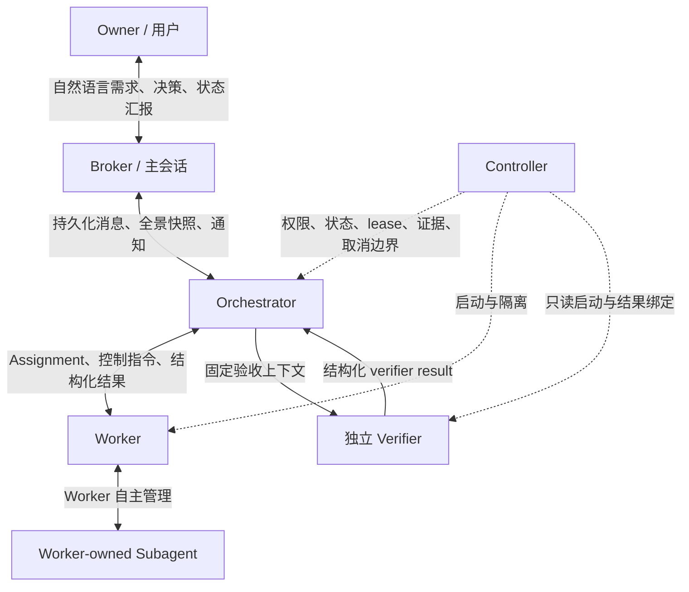

# Codex Crew Orchestrator/Worker 设计基线

## 文档定位

本文是 Broker、Orchestrator、Worker、Verifier 与 Worker-owned Subagent 控制权模型的设计存档。它解释稳定边界，不是运行时配置或第二状态源；字段、版本、模型和推理强度以 canonical JSON/Schema 为准，当前 maturity 仍为 `design_baseline`。显式 assignment、selected Worker cohort、Crew panorama、Full Verifier、acceptance、finish、Owner request、notification 和 cancel 已接入 controller；跨 worktree promotion、外部 API assignment 与跨版本恢复仍不能仅凭本文视为已验证能力。

## 产品目标

Owner 只通过 Broker 进行正常业务交流并观察全局状态；Broker 把需求、纠偏和 Owner decision 交给一个持久 Orchestrator。Orchestrator 管理 run、assignment、依赖、workspace lease、Worker、Verifier 和 acceptance，但不修改业务交付物。Worker 独立拥有一个有界交付责任，完成分析、设计、实现、自验和证据整理，并自主使用自己的 Subagent。

控制面是由 Orchestrator 驱动的能力宿主，只机械维护角色权限、assignment identity、依赖、写 lease、Owner gate、事实验收和取消收口。Orchestrator 观察事实、决定下一步并调用底层能力；controller 不根据局部状态自动推导后续流程。拆分理由、实现步骤、prompt、Subagent 数量、review 方式和调度策略优先使用自然语言，不建成逐节点工作流。

## 控制链与通信



- Broker 拥有 Owner-facing 对话和全局展示权，但没有 canonical 业务规划权。它不能自行决定 run 切分、assignment、assurance、依赖或执行布局；自己的推演必须标成非权威建议，并交回同一 Orchestrator。Broker 向 Owner 展示 controller 记录的全景状态和 Orchestrator 主动上报的重大调整，不把自己的解释写回 canonical plan。
- Orchestrator 是一次 run 的唯一业务 controller，只有它能创建或修订 assignment、选择 Worker、调整执行布局、处理纠偏、请求 Owner、调用 Verifier 和决定 acceptance/finish。它必须持续掌握直属 Worker 的全景，但不直接写业务交付物，也不管理 Worker 的 Subagent。
- Worker 是一个 assignment revision 的完整交付 owner。它只向 Orchestrator报告状态、结果、证据和边界请求，不直接联系 Broker 或 Owner。
- Verifier 是 controller 创建的 fresh、read-only、非递归独立角色，只复核固定 assignment revision、base/head commit、Worker result digest 和 acceptance criteria；它不能写 canonical state，也不能派生 verifier。
- Subagent 只受所属 Worker 控制，不可由顶层寻址，不成为顶层验收主体。Worker 只聚合必要的 delegation 和 evidence provenance。

## Crew 全景与动态调度

Orchestrator 必须能够看到并维护自己的 Crew 全景：当前可调用的一级角色和能力、assignment 及依赖、Worker identity/thread、运行或等待状态、write ownership、workspace/branch binding、assurance、Verifier 状态、Owner request、活跃 lease 和最近结果。Broker 与 Owner 读取同一 canonical 投影，因此能知道全局正在发生什么，但不会直接控制 Worker。

全景不是固定 workflow。`read-only`、单写者或多写者只描述当前意图和已观察到的执行事实，不要求 controller 按某个 topology 模板自动选取 ready assignment、预建 workspace 或启动 Worker。Orchestrator 可以在运行中增删 assignment、串并行切换、继续或重派 Worker、调整 workspace/branch 方案；controller 只校验调用当下是否越过权限、依赖、ownership、lease、授权和证据边界。

Orchestrator 对会影响 Owner 预期的重大调整主动向 Broker 发出通知，例如交付范围或责任边界变化、从串行调整为并行、Worker 重派、关键依赖改变、出现 Owner gate、预计交付形态变化或进入 blocked/quarantine。普通实现策略和 Worker 内部步骤不逐项上报；只有越过既有授权边界时才需要 Owner 批准。

## Assignment 是责任边界

Assignment 不机械对应 Issue、package 文件或内部步骤。目标、权限、写 ownership、交付责任和独立 acceptance boundary 相同的 package、implementation、review loop 以及 T1–T5 默认由同一个 Worker 完成；只有其中任一边界实质变化时，Orchestrator 才创建新的 assignment。

每个 assignment 至少绑定 identity/revision、目标、非目标、自然语言 acceptance criteria、允许路径、外部资源、依赖、assurance/profile、上下文策略、workspace 策略、Worker 结果、controller-owned verifier 状态和 acceptance。当前契约内的 bounded correction 可以继续同一 Worker；范围、权限或交付责任变化需要新 revision 或新 assignment。

Worker 数量、assignment 精确拆分、Subagent 数量和内部 turn 顺序都不是验收门。验收只关心角色边界、授权、依赖、写隔离和同 revision 事实证据。

## Run、上下文、分支与 worktree

Run 是一个 Orchestrator 控制生命周期，不是分支或 PR。一个 run 可以交付多个 assignment、branch、worktree 和 PR；安全上限只约束同时活跃的写 lease，不约束 run 内累计创建过多少 branch/worktree，也不替 Orchestrator决定物理布局。

Fresh context、Worker dispatch、活跃写 worktree 和 assurance 是四个独立事实，不能互相推导。Issue 数量、fresh Worker、run 数量和 DAG 理论并行性都不能单独决定 worktree 数量。

Worker 的访问方式也是独立事实。`repository_read_only` assignment 绑定固定 repository HEAD 与运行前 Git porcelain，以 fresh read-only Worker thread 执行，不创建 branch、worktree 或 write lease；Controller 在 Worker 返回后再次记录 HEAD 与 porcelain，任一漂移都会阻断结果和 acceptance。`workspace_write` assignment 才进入 Orchestrator 决定的 workspace/branch 与写 lease。两者复用同一 assignment、profile、cohort、result、Owner routing、Verifier 和 cancel 能力，不形成第二套 dry-run workflow。

Workspace、branch、comparison point 和是否复用由 Orchestrator 按任务需要决定。底层能力可以提供安全的新建方案和复用检查，但不能因 Issue 数量、ready 集合或 topology 标签自动创建。复用必须绑定明确 handoff，并在 materialize 前验证前序 acceptance、commit、clean tree、祖先连续和验证证据；同时写入者必须使用互相隔离且 ownership 不冲突的 workspace。取消未确认或资源被 quarantine 时禁止复用。

Linked worktree 中的 Worker 要提交代码时，workspace-write 还必须允许最小 Git metadata 写入。Controller 只放行该 linked worktree 的专属 Git dir、共享 object database，以及 `codex/crew/<run-id>/<assignment-id>/...` 下该 assignment 自己的 ref/log 目录；整个 common `.git` 不进入 writable roots。这个约束让 Orchestrator 仍可决定 branch 后缀和物理布局，同时防止一个 Worker借 Git metadata 权限改写 sibling branch。

是否串行或并行由 Orchestrator 根据任务、Worker 状态和协调收益决定。Controller 只在启动 selected cohort 时检查运行时确实具备相应能力、依赖已经满足、同时写 ownership 互斥且未超过安全 lease 上限；它不维护一个驱动后续动作的固定 topology 状态机。当前 controller 已支持同一进程内的显式 cohort 并发并等待本批收口，但跨 worktree promotion 仍未闭合，不能把并发能力宣传为自动 integration 或 merge。

## Full 验收

Lite 可以由 Orchestrator 基于 commit、clean tree、允许路径和确定性验证证据接受。Full 在这些事实之外必须取得 controller-owned 独立 verifier attempt；Orchestrator 自报、Worker 自验和 Worker-owned Subagent 输出都不能替代该证据。Controller 提供绑定固定 comparison point 的 Verifier 能力，但不因 Worker 返回 `succeeded` 自动启动；调用时机、是否先让 Worker 补充证据以及 bounded correction 顺序由 Orchestrator决定。

Verifier attempt 绑定 assignment revision、base/head commit、Worker result digest、实际 profile/thread/turn、findings 和 verification evidence。每次 bounded correction 后可创建新 attempt，历史 attempt 保留；只有最新且绑定相同 revision/head/result 的 `passed` attempt 才能支持 Orchestrator accept。Profile 不可用、结果 `failed/blocked`、commit 漂移或 provenance 不完整时 fail closed。

Worker-level acceptance 只表示该 assignment 越过自身边界，不自动代表 run、merge、release、外部 mutation 或 Owner 最终 promotion 已完成。

## Owner gate 与 run 收口

Worker 的 `needs_owner` 默认只暂停当前 assignment；现有 assignment 依赖自然阻止其严格下游，Orchestrator 仍可继续调度无依赖工作。Owner decision 必须绑定 request identity、授权范围和 provenance。只有真正影响整个交付程序的产品或权限决策才形成 run-level gate；`awaiting_owner` 可以作为当前无其他可执行工作时的全景展示，但不应由任一局部 request 自动推导为全局停机。

Assignment acceptance 不自动令 run 成功。Orchestrator 在判断交付已达到当前终点后显式 `finish`，向 Broker 提交权威总结和 terminal disposition；controller 只检查没有未停止的受控执行，并验证所声明的成功、部分完成、blocked 或 needs-owner 结论与 canonical evidence 一致。这样 `finish` 是 Orchestrator 的业务判断，不是 acceptance 之后被写死的下一节点。

## 显式取消

正常 Broker、Orchestrator、Worker 和 Verifier turn 不因等待时长或静默自动 interrupt。只有用户明确 cancel 才能通过 `<state>.cancel-request.json` 原子 sidecar 请求停止；sidecar 先记录 run、request、reason、provenance 和时间，不争抢 active controller lock。

持有当前 App Server session 的 runner 读取请求后停止新 dispatch，记录 `cancelling`，interrupt 当前受控 turn 并收集 terminal evidence。停止被证实后写 `cancelled`；无法确认时写 `blocked/quarantine`，相关 workspace 禁止复用。CLI 等待窗口结束只能报告 request pending，不能冒充 turn timeout 或成功取消；重复 request 按 request identity 幂等处理。

## 薄控制面实现边界

```text
Codex/App Server transport
  -> 通用 role-turn runner
  -> Orchestrator controller
  -> Worker/workspace primitive
  -> canonical state and evidence
```

底层 transport 只负责 command discovery、JSON-RPC、thread/turn 和 interrupt。通用 role-turn runner 复用 Orchestrator、Worker、Verifier 的启动、观察、结构化 envelope 和 cancel hook。Controller 向 Orchestrator 提供可组合的底层能力：查看全景、定义或修订 assignment、启动或继续 Worker、调用 Verifier、接受 assignment、请求或应用 Owner decision、finish 和 cancel。能力名称可以由协议版本化，但 controller 不把它们连接成固定业务流程。Workspace guard 只检查路径、branch、clean、ancestor、lease 和 handoff，不演化成 Git workflow engine或 scheduler。

自然语言承载目标、非目标、拆分理由、调度策略、并行收益、实现设计、纠偏说明和重大调整通知；DTO 只承载必须机械阻断或审计的 identity、authority、dependency、lease、commit、verification、verifier、Owner decision、acceptance、cancel 和 terminal facts。能由 canonical facts 计算出的当前活跃写入者数量、可运行 assignment 和观察到的执行形态优先派生，不要求多个角色重复维护。

POC 默认不设置基于 action 数量的自动终止上限。运行通过显式 cancel、权限边界、资源 lease、profile 可用性和证据 gate 控制风险；如果未来需要 action budget，它必须是 Owner 可见、run-scoped 且可调整的资源政策，不能作为隐藏的固定流程长度。

## 非目标与能力边界

- 不让 Broker 成为第二 Orchestrator，也不让 Orchestrator 或 Verifier补业务实现。
- 不把 Worker 内部 package、T-step 或 Subagent 变成顶层 graph 节点。
- 不新增 daemon、child scheduler、跨 worktree integration receiver 或自动 promotion 系统。
- 不根据 ready、Worker success、assignment acceptance 或局部 Owner request 自动串接下一项业务动作。
- 不自动 merge、release、cleanup、扩大权限或执行不可逆外部 mutation。
- 不将结构化可表达等同于 runtime 已闭合；真实并发、跨 worktree promotion、外部 API assignment 和跨任意 App Server 版本恢复仍需独立证据。
- Package stage runner 不是 Crew 的第二个业务入口；新状态不兼容旧 control/policy/profile 版本，无法续跑时明确 fail closed。

## 设计验收场景

- Canonical snapshot 为零 assignment 时，Broker 只能报告零；自己的候选规划不能启动 Worker。
- 一个完整交付责任中的 package、implementation、review 和内部阶段由一个 Worker ownership 覆盖。
- Orchestrator 能看到直属 Worker、assignment、workspace/branch、lease、Verifier 和 Owner gate 的统一全景，并可在边界内动态调整和向 Broker 通知重大变化。
- 同一 run 的多个 assignment 可以由 Orchestrator 选择不同或复用的 branch/workspace；controller 只约束同时写 lease、ownership 和 handoff 安全。
- 显式 `reuse` 只有在完整 handoff gate 后通过；缺失任一事实即拒绝 materialize。
- Full Worker 成功后由 Orchestrator决定何时调用 fresh read-only Verifier；只有 controller-owned、同 revision/head/result 的 passed attempt 支持 accept。
- Assignment 的局部 Owner request 只阻断自身及明确依赖者；Orchestrator 可以继续无依赖工作并在需要时通知 Broker。
- Assignment acceptance 不自动关闭 run；Orchestrator 显式 finish，controller 核对 terminal claim 与事实。
- 长期 run 不因默认 action count 被中止，只有显式 cancel 或硬边界失败改变执行资格。
- 用户 cancel 可以中止当前 Orchestrator、Worker 或 Verifier；未确认停止时 quarantine，不复用资源。
