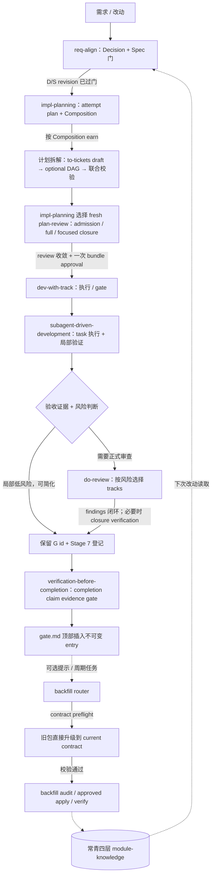

# Impl-Package 体系 · 入口地图

本 skill 是整个 Impl-Package 体系的**导航入口**。它只回答「这是什么、从哪进、下一步进哪个 skill」，把你送到正确的 stage skill 或 canonical 源。**它不执行任何阶段，也不把 spec / contract / decision 的正文抄进来**——正文永远留在各自的事实源，这里只给指针。

所有阶段执行器都递归聚合在本目录下；implementation-level review 统一位于 `reviews/`。`backfill-stable-docs` 也属于本体系的维护阶段，物理位于本目录下但保留公共 skill name；调用方按名称路由，不依赖旧的根目录路径。

持久单位是项目约定的 implementations root（默认 `docs/implementations/`）下的 `<package-id>/`。`.impl-package/` 结构化层以 revision binding、earned runtime state、artifact hash chain 与 finalized gate index保存机器可校验状态，Markdown 只保留判断、证据叙述及 machine-owned 投影；agent 通过随 skill 分发的 `scripts/impl_package_state.py --package <path> ...` 维护，不手改投影。canonical handoff 汇总人类当前状态；attempt 的 Draft/Active/Frozen 现场派生，不落可过期 status。

结构化状态引擎的数据策略统一由 [`assets/impl-package-state-config.json`](./assets/impl-package-state-config.json) 提供，当前体系契约版本为字符串 `"3.2"`：状态 vocabulary、document discovery/field regex、marker 名称、投影格式与 gate heading/字段 grammar 在该版本化配置中调整，CLI interface 不变。配置未知版本、缺字段、错误 placeholder/capture group、重复/空 vocabulary 或无效 regex 必须 fail closed。append-only、CAS、active chain、package-local path、完整 gate entry span/content hash、HEAD/worktree 两相校验与 task/ticket bijection 属于不可配置的安全内核；不得通过配置弱化。backfill gate recognition 直接复用 canonical resolver，不复制 verdict、heading 或 binding 语义。契约修订摘要保存在 [`assets/contract-revision-history.md`](./assets/contract-revision-history.md)，仅在 `contract-status` 返回 `upgradeRequired` 时读取；正常 stage、validate、audit、apply、verify 路径不得读取它。

旧 schema 不兼容；发现 `upgradeRequired` 时，直接按当前 schema 重塑 package，重新通过 canonical preflight 后再进入后续阶段。

revision alias 继续使用 `D<n>` / `S<n>` / `P<n>`，其中 D 明确表示 Decision。

- **文档维护层**：常青四层（产品/journey 端到端意图 / 模块贡献 / 模块契约 / 变更事件），真相住这里；跨模块 journey 通过唯一 owner 和 anchor 链接下钻，不复制正文。开发收口后可以通过 backfill 把 durable delta 汇回。
- **开发 6 步主流程 + 可选回刷**：6 步把改动做出来；backfill 是收口后的维护提示与周期性兜底，不阻塞当前交付。

## 系统图（供 AI 读取）

`to-tickets` 与 `create-task-dag` 是同一 earn-gated 计划拆解阶段的工具化步骤。`impl-planning` 形成并审查完整 candidate bundle 后，只在一次 bundle approval 写入、登记并路由到执行；权威细则见 [共享 contract](references/impl-package-composition-contract.md)。backfill 虚线是异步维护提示：gate 关闭后应提醒 owner 可以运行 `$backfill-stable-docs`，但不自动执行、不要求本次完成，也不影响当前 gate 或任务的 closed 判断；真正压实可由后续 audit / approved apply / verify 或周期任务完成。

当 review baseline fresh、owner 已批准当前 manifest、没有 unresolved blocker，且变更只涉及规划文档、Ticket publication 与 D/S/P binding 时，使用 [planning-only fast apply runbook](references/plan-apply-runbook.md)。它把授权校验、Ticket 原子发布、revision 注册、projection 刷新和一轮汇总验证收敛为一次可恢复本地事务；commit/push 与 PR/Issue 摘要同步保持为独立后续动作。

## 阶段地图

| 阶段 | Owner skill | 产出 | 何时 |
| --- | --- | --- | --- |
| 1 对齐与调研 | `req-align`（Decision 门） | Focused PRD + 方案决策的 `decision.md`（新功能/体验/业务变化通常 earned；小修正可 lightweight） | 新需求 / 需求变更，动手前 |
| 2 写规格 | `req-align`（Spec 门） | 当前 `spec.md` revision | Decision 门过后 |
| 3 Attempt 计划 | `impl-planning` | `plan.md` / patch plan（含 Composition） | Spec 过、要落地 |
| 4 计划拆解（按需） | `to-tickets` → `create-task-dag` → `impl-planning` 选择适用的 `plan-review` | 按 Composition earned 的 `tickets/` 与/或当前 attempt DAG；联合校验、fresh 独立审查与一次 owner approval | plan 判 `tickets=true` 或 `dag=true` |
| 5 执行 | `dev-with-track` + `subagent-driven-development` | runtime state · machine-owned `progress.md` · Attempt ER · append-only `gate.md` | 上游就绪 / 跨 session 续；有可委派 task 时由后者承载 |
| 6 审查 | agent 风险判断后按需交给 `do-review`；可选择 `code-review`、`standards-review`、`spec-review` 与 `safety-review` | review evidence 或简化理由（进入 plan ER） | 见下方路由 |
| 6b Completion claim gate | `verification-before-completion` | claim-to-evidence audit | 写 terminal pass 或宣称 complete / closed / merge-ready / release-ready 前 |
| 可选回刷 | `$backfill-stable-docs`（体系内维护阶段） | contract preflight、audit report / approved apply / independent verify；必要时更新 `_pending.md` | gate 关闭后提示；积累 durable delta 或周期维护时执行，不阻塞当前交付 |

## 正向路由：你在哪 → 进哪个 skill

**计划 bundle 的授权连续性**只由[共享 contract 的一次 checkpoint](references/impl-package-composition-contract.md)定义；本入口不复制其行为细节。

- 先按共享 contract 的四个瞬时影响信号做轻量分流。纯减法、证据修正、引用/分类修正或局部可逆调整若不改变当前业务结果、Acceptance Semantics、D/S contract、plan-owned execution strategy、Composition、安全约束或 mutation authority，直接交给现有 artifact 的 owning skill 做局部修正和定向验证；不为了“进流程”调用 `req-align`、创建新 revision 或扩写 JSON。
- 复杂业务动作、`material seam` 或昂贵系统验证需要选择渐进式证据时，读取 [渐进式系统证据](references/progressive-system-evidence.md)，再继续由当前 owning stage 执行；它不是新 stage、gate 或 approval。
- 有新改动 / 需求，且会改变决策选择或行为 contract → **`req-align`**（先过 Decision、再过 Spec 门；当 acceptance 依赖权威证明、发布状态、兼容投影或外部副作用时，由该 skill 条件化定义 evidence-integrity contract；provider、schema、archive、CLI 等只是例子）。
- Spec 已过门，还没 plan → **`impl-planning`**。
- 当前 attempt plan 判 `tickets=true` 或 `dag=true`，计划拆解 bundle 尚未 ready → 交给 **`impl-planning`** 编排 `to-tickets`、`create-task-dag`、同一 candidate bundle 的 review 与一次 approval。
- 上游产物就绪，要开始 / 恢复执行 → **`dev-with-track`**（运行时计划执行与 gate 的唯一 owner）；GO 后的实现、适用 review、修复、验证和 gate 收口由该 skill 的权威段落连续完成。
- 集成后先作简短风险判断并记录到 ER：局部、可逆、无共享 contract/状态/外部副作用且已有定向证据的改动，可以不触发正式 `do-review`，直接进入 completion claim audit；需要独立审查时，把明确 reviewer selection 交给 `do-review`。接口、状态机、模块边界、跨模块行为或 seam 是选择 `standards-review` / `spec-review` 的强信号；auth、权限、支付、webhook、迁移、外部 mutation、数据完整性或并发安全是选择 `safety-review` 的不可简化信号。`code-review` 是普通实现的默认选择，但 agent 可以在 ER 中写明低风险理由和已覆盖的定向验证后省略。`do-review` 是一旦被选择时唯一负责范围固定、leaf 调度、ledger 与最终分类的编排器；只有它提出 P1/P2 findings 后才需要 closure verification。
- 适用 review 与 execution findings 已闭环、准备写 terminal pass 或对外宣称 complete / closed / merge-ready / release-ready → **`verification-before-completion`**（由 **`dev-with-track` 在自动收口中调用**）；它审计最终 revision、环境和证据新鲜度，不是 DAG task，也不机械重跑所有检查。
- gate 已关 → **提示**可按需使用 `$backfill-stable-docs` 处理 durable delta。调用 backfill 时先完成独立 contract preflight：旧包由 agent 读取修订摘要并直接改成 current contract，校验通过后才进入只读 audit/apply/verify；升级失败不得继续审计。提示不等于执行授权：只有用户要求、已有明确维护计划，或进入周期性 audit / approved apply / independent verify 时才实际调用；本轮不做 backfill 也可以正常收口。

断链就退回真正拥有变化语义的上游，别按目录层级整链回滚：缺 plan 回 `impl-planning`；输入太宽没切片回计划拆解的 `to-tickets` draft；Ticket/DAG 联合校验失败留在计划拆解并只修订受影响 artifact；Composition/artifact 对不上回 `impl-planning`；只有暴露出真实 contract drift 才回 `req-align` 重过受影响的门。单个 artifact 的证据、引用或分类变化不自动使其他 artifact 失效。

退回上游不等于请求 owner 再授权。若修正不改变业务结果、AC、安全/数据约束、Composition 或外部 mutation authority，只是修复 typed edge、执行顺序、evidence producer 投影或 artifact 引用，则 owning skill 机械修正并继续。只有能列出会产生不同业务结果的选项时，才把它报告为 owner decision。

体量不预先分档，只看当前 attempt 的两个开关；可用 dispatch shorthand（`S`/`M`/`L`/`D`）快速下发，但它只展开成当前 plan 的 `tickets=/dag=`，earn 条件仍是权威。

用户可以主动说“按 S / M / L / D 做”，把它作为期望的执行组合交给 `impl-planning`。agent 必须先展开并校验 earn 条件：一致时采用；冲突时先用人话说明实际信号、建议组合和会增删哪些 artifact，等待 owner 决议，不能静默改模式或直接造/删 ticket、DAG。

## 面向 owner 的汇报

所有阶段与 review skill 向 owner 汇报 proposal、状态、review、gate 或交付时直接使用 `talk-to-boss`；本体系不复制它的通用汇报方法，只补以下适配：

- `package-id`、Attempt / D-S-P-G revision、Composition、ticket/task ID、ER/gate anchor、路径和命令只作为 canonical handoff 或技术证据，不作为人类汇报开场。
- 同一回复同时面向 owner 与下游 agent 时，先给 `talk-to-boss` 的决策摘要与功能主体，再附 canonical handoff。
- S/M/L/D 首次出现在人类汇报时必须展开为自解释执行组合，不能裸报字母或布尔值。
- stage 自己的 Output Contract 只定义额外 handoff/evidence 字段，不得覆盖 `talk-to-boss` 的人类汇报顺序。

## Canonical 源（只给指针，不在这里复制正文）

属于 Impl-Package 依赖图的文档全部收在本 skill 的 `references/` 下，不论是否仍标草案——分发单位是这个 skill 目录，组内分享时不会附带整个仓库的 `docs/skill-design/`，所以依赖图内的东西必须随 skill 一起走。`docs/skill-design/` 只保留不属于本体系的其他设计规划。

- **规则 / 跨层契约（正式）** → [references/impl-package-composition-contract.md](references/impl-package-composition-contract.md)（composition、derived lifecycle、readiness resolution、seam、Stage 7、dispatch shorthand、revision-blob binding、Module Knowledge Watermark）。
- **结构化状态 schema（正式）** → [references/impl-package-state-schema.md](references/impl-package-state-schema.md)（sidecar shape、CLI、projection、current-contract 校验、gate content binding 与消费结果；旧 schema 不再由运行时兼容解析）。
- **planning-only fast apply（正式操作 runbook）** → [references/plan-apply-runbook.md](references/plan-apply-runbook.md)（clearance/owner authorization、原子 Ticket publish、D/S/P binding、恢复、输出和独立 Git/GitHub handoff）。
- **backfill / 常青四层（正式，已批准）** → [references/evergreen-module-spec-and-backfill-design.md](references/evergreen-module-spec-and-backfill-design.md)。
- **渐进式系统证据（指导性）** → [references/progressive-system-evidence.md](references/progressive-system-evidence.md)（围绕 system assumption、忠实边界、昂贵 E2E、checkpoint、failure learning 与 claim-scoped freshness 选择证据；不改变 artifact lifecycle）。
- **体系设计 rationale（仍为方案草案，内容仍会演进）** → [references/impl-package-system-design.md](references/impl-package-system-design.md)。
- **给人看的介绍页** → [assets/impl-package-intro.html](assets/impl-package-intro.html)。**推荐给需要总览的人打开；本 skill 自身不读取它**（避免把整页载入上下文）。

## 护栏

- 只导航与路由；**不执行**任何阶段——执行永远交给对应 stage skill。
- **不复制**各 skill / 契约 / 设计的正文；概念一律给指针，防止双重维护（这正是体系反对的）。
- `assets/impl-package-intro.html` 是给人的产物，**不主动读取**；需要时把路径推荐给用户打开即可。
