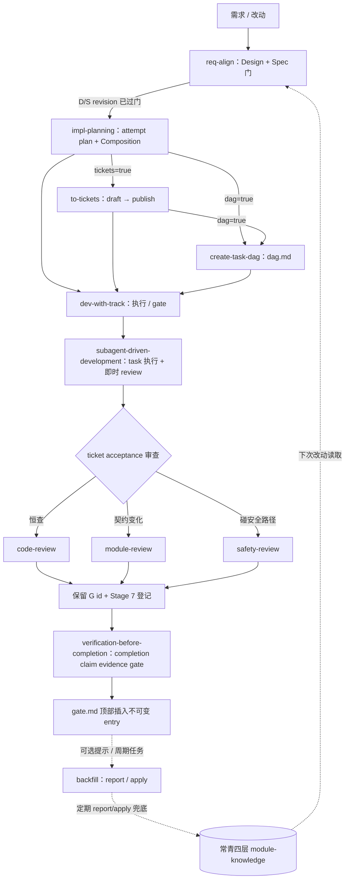

# Impl-Package 体系 · 入口地图

本 skill 是整个 Impl-Package 体系的**导航入口**。它只回答「这是什么、从哪进、下一步进哪个 skill」，把你送到正确的 stage skill 或 canonical 源。**它不执行任何阶段，也不把 spec / contract / design 的正文抄进来**——正文永远留在各自的事实源，这里只给指针。

所有阶段执行器都递归聚合在本目录下；implementation-level review 统一位于 `reviews/`。skill name 保持稳定，调用方按名称路由，不依赖旧的根目录路径。

持久单位是 `docs/implementations/<package-id>/`。内部 sidecar `.impl-package/revision-bindings.json` 以外部 Git blob binding 选择当前 D/S/attempt，避免 artifact 自身保存自身 hash；它只服务机器校验，不是 owner-facing deliverable。人类交付仍由 design/spec/plan/gate/handoff Markdown 按职责提供可读投影，并由 canonical handoff 汇总当前状态；attempt 的 Draft/Active/Frozen 由内部 registry 与 gate ledger 派生，不在 plan 手工维护。体系由两部分咬合：

- **文档维护层**：常青四层（产品/journey 端到端意图 / 模块贡献 / 模块契约 / 变更事件），真相住这里；跨模块 journey 通过唯一 owner 和 anchor 链接下钻，不复制正文。开发收口后可以通过 backfill 把 durable delta 汇回。
- **开发 6 步主流程 + 可选回刷**：6 步把改动做出来；backfill 是收口后的维护提示与周期性兜底，不阻塞当前交付。

## 系统图（供 AI 读取）

`to-tickets` 与 `create-task-dag` 是 earn-gated 的按需步：只有当前 attempt plan 判定 `tickets=true` / `dag=true` 才走。backfill 虚线是异步维护提示：gate 关闭后应提醒 owner 可以运行 `backfill-stable-docs`，但不自动执行、不要求本次完成，也不影响当前 gate 或任务的 closed 判断；真正压实可由后续 report / apply 或周期任务完成。

## 阶段地图

| 阶段 | Owner skill | 产出 | 何时 |
| --- | --- | --- | --- |
| 1 对齐与调研 | `req-align`（Design 门） | `design.md` | 新需求 / 需求变更，动手前 |
| 2 写规格 | `req-align`（Spec 门） | 当前 `spec.md` revision | Design 门过后 |
| 3 Attempt 计划 | `impl-planning` | `plan.md` / patch plan（含 Composition） | Spec 过、要落地 |
| 3b 切票（按需） | `to-tickets` | 当前 attempt 的 `tickets/` | plan 判 `tickets=true` |
| 4 排执行图（按需） | `create-task-dag` | 当前 attempt DAG | plan 判 `dag=true` |
| 5 执行 | `dev-with-track` + `subagent-driven-development` | runtime state / task review evidence · plan Execution Record · append-only `gate.md` | 上游就绪 / 跨 session 续；有可委派 task 时由后者承载 |
| 6 审查 | `code-review`（恒） · `module-review` · `safety-review` | review evidence（进入 plan ER） | 见下方路由 |
| 6b Completion claim gate | `verification-before-completion` | claim-to-evidence audit | 写 terminal pass 或宣称 complete / closed / merge-ready / release-ready 前 |
| 可选回刷 | `backfill-stable-docs` | report / approved apply；必要时更新 `_pending.md` | gate 关闭后提示；积累 durable delta 或周期维护时执行，不阻塞当前交付 |

## 正向路由：你在哪 → 进哪个 skill

- 有新改动 / 需求，还没进流水线 → **`req-align`**（先过 Design、再过 Spec 门；当 acceptance 依赖权威证明、发布状态、兼容投影或外部副作用时，由该 skill 条件化定义 evidence-integrity contract；provider、schema、archive、CLI 等只是例子）。
- Spec 已过门，还没 plan → **`impl-planning`**。
- 当前 attempt plan 判 `tickets=true`，还没票 → **`to-tickets`**（draft → owner 批准 → publish）。
- 当前 attempt plan 判 `dag=true`，plan（及相关 approved 票）就绪 → **`create-task-dag`**。
- 上游产物就绪，要开始 / 恢复执行 → **`dev-with-track`**；它从 revision registry 与 gate 派生 lifecycle、选择可执行单元并维护状态。存在有界、可委派 task 时，进入 **`subagent-driven-development`** 完成实现和 task-level 双 review，再返回前者集成；存在 manual owner 时，等待验收前按轻量模板生成 readiness handoff。
- 集成后要审查：`code-review` 恒查；改动 interface / seam / 契约 → **`module-review`**；碰 auth / 支付 / webhook / 迁移 / 外部写入 → **`safety-review`**。
- 适用 review 与 findings 已闭环、准备写 terminal pass 或对外宣称 complete / closed / merge-ready / release-ready → **`verification-before-completion`**；它审计最终 revision、环境和证据新鲜度，不是 DAG task，也不机械重跑所有检查。
- gate 已关 → **提示**可按需使用 `backfill-stable-docs` 处理 durable delta。提示不等于执行授权：只有用户要求、已有明确维护计划，或进入周期性 report / approved apply 时才实际调用；本轮不做 backfill 也可以正常收口。

断链就退回上游，别硬猜：缺 plan 回 `impl-planning`；输入太宽没切片回 `to-tickets`；Composition/artifact 对不上回 `impl-planning` 修订 P revision，只有暴露出真实 contract drift 才回 `req-align` 重过相应门。

退回上游不等于请求 owner 再授权。若修正不改变业务结果、AC、安全/数据约束、Composition 或外部 mutation authority，只是修复 typed edge、执行顺序、evidence producer 投影或 artifact 引用，则 owning skill 机械修正并继续。只有能列出会产生不同业务结果的选项时，才把它报告为 owner decision。

体量不预先分档，只看当前 attempt 的两个开关；可用 dispatch shorthand（`S`/`M`/`L`/`D`）快速下发，但它只展开成当前 plan 的 `tickets=/dag=`，earn 条件仍是权威。

用户可以主动说“按 S / M / L / D 做”，把它作为期望的执行组合交给 `impl-planning`。agent 必须先展开并校验 earn 条件：一致时采用；冲突时先用人话说明实际信号、建议组合和会增删哪些 artifact，等待 owner 决议，不能静默改模式或直接造/删 ticket、DAG。

## 面向 owner 的汇报

所有阶段与 review skill 向 owner 汇报 proposal、状态、review、gate 或交付时直接使用 `talk-to-boss`；本体系不复制它的通用汇报方法，只补以下适配：

- `package-id`、Attempt / D-S-P-G revision、Composition、ticket/task ID、ER/gate anchor、路径和命令只作为 canonical handoff 或技术证据，不作为人类汇报开场。
- 同一回复同时面向 owner 与下游 agent 时，先给 `talk-to-boss` 的决策摘要与功能主体，再附 canonical handoff。
- S/M/L/D 首次出现在人类汇报时必须展开为自解释执行组合，不能裸报字母或布尔值。
- stage 自己的 Output Contract 只定义额外 handoff/evidence 字段，不得覆盖 `talk-to-boss` 的人类汇报顺序。

## Canonical 源（只给指针，不在这里复制正文）

属于 Impl-Package 依赖图的文档全部收在本 skill 的 `references/` 下，不论是否仍标草案——分发单位是这个 skill 目录，组内分享时不会附带整个仓库的 `docs/skill-design/`，所以依赖图内的东西必须随 skill 一起走。`docs/skill-design/` 只保留不属于本体系的其他设计规划。

- **规则 / 跨层契约（正式）** → [references/impl-package-composition-contract.md](references/impl-package-composition-contract.md)（composition、derived lifecycle、readiness resolution、seam、Stage 7、dispatch shorthand、revision-blob binding、Module Knowledge Watermark）。
- **backfill / 常青四层（正式，已批准）** → [references/evergreen-module-spec-and-backfill-design.md](references/evergreen-module-spec-and-backfill-design.md)。
- **体系设计 rationale（仍为方案草案，内容仍会演进）** → [references/impl-package-system-design.md](references/impl-package-system-design.md)。
- **给人看的介绍页** → [assets/impl-package-intro.html](assets/impl-package-intro.html)。**推荐给需要总览的人打开；本 skill 自身不读取它**（避免把整页载入上下文）。

## 护栏

- 只导航与路由；**不执行**任何阶段——执行永远交给对应 stage skill。
- **不复制**各 skill / 契约 / 设计的正文；概念一律给指针，防止双重维护（这正是体系反对的）。
- `assets/impl-package-intro.html` 是给人的产物，**不主动读取**；需要时把路径推荐给用户打开即可。
